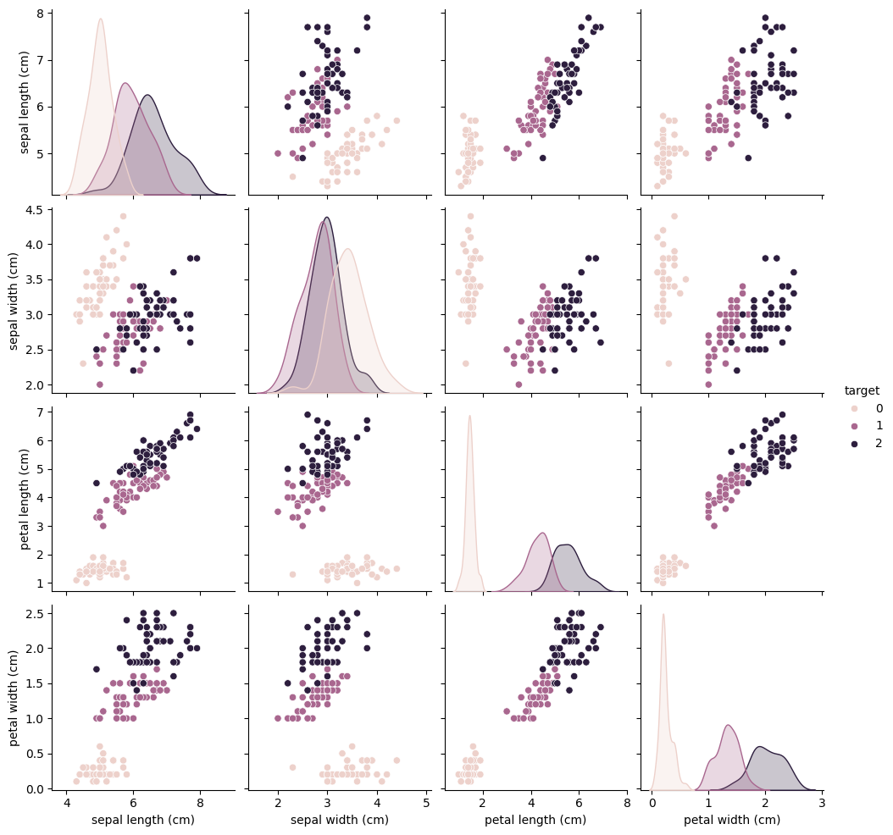

# MetaGPT version 0.7

最核心功能update： code_interpreter

## CodeInterpreter 使用尝试

安装：使用开发模式安装
```
git clone https://github.com/geekan/MetaGPT.git
cd MetaGPT
pip install -e .

```

设置

使用azure openAI
根据`MetaGPT/config/config2.yaml.example` 修改 `config2.yaml`

```
llm:
  api_type: "azure"  # or azure / ollama etc.
  base_url: "xxx"
  api_key: "xxx"
  model: "gpt35turbo16k"  # Deployment-name
  api_version: "2023-07-01-preview" # config2.yaml.example 中没有提及，需要加入
```

使用：`python examples/ci/data_visualization.py`

### 效果

1. 首先任务分解：
```json
[
    {
        "task_id": "1",
        "dependent_task_ids": [],
        "instruction": "Load the sklearn Iris dataset."
    },
    {
        "task_id": "2",
        "dependent_task_ids": ["1"],
        "instruction": "Perform exploratory data analysis on the Iris dataset."
    },
    {
        "task_id": "3",
        "dependent_task_ids": ["2"],
        "instruction": "Create a plot visualizing the Iris dataset."
    }
]
```
2. 使用code_interpreter 写代码： task1 -- load dataset
```
| INFO     | metagpt.roles.role:_plan_and_act:494 - ready to take on task task_id='1' dependent_task_ids=[] instruction='Load the sklearn Iris dataset.' task_type='' code='' result='' is_success=False is_finished=False
| INFO     | metagpt.roles.ci.code_interpreter:_write_code:79 - ready to WriteCodeWithoutTools
```
code:
```
  1 from sklearn.datasets import load_iris                                                                            
  2 iris_data = load_iris()                                                                                           
  3 iris_data['data'][0:5], iris_data['target'][0:5]  
"""
(array([[5.1, 3.5, 1.4, 0.2],
        [4.9, 3. , 1.4, 0.2],
        [4.7, 3.2, 1.3, 0.2],
        [4.6, 3.1, 1.5, 0.2],
        [5. , 3.6, 1.4, 0.2]]),
 array([0, 0, 0, 0, 0]))

""" 
```
3. task2: data analysis
```
| INFO     | metagpt.roles.role:_plan_and_act:494 - ready to take on task task_id='2' dependent_task_ids=['1'] instruction='Perform exploratory data analysis on the Iris dataset.' task_type='' code='' result='' is_success=False is_finished=False
| INFO     | metagpt.roles.ci.code_interpreter:_write_code:79 - ready to WriteCodeWithoutTools


```
code:
```
import pandas as pd                                                                                              
   2                                                                                                                  
   3 # Create a DataFrame from the iris dataset                                                                       
   4 iris_df = pd.DataFrame(iris_data['data'], columns=iris_data['feature_names'])                                    
   5 iris_df['target'] = iris_data['target']                                                                          
   6                                                                                                                  
   7 # Summary statistics                                                                                             
   8 summary = iris_df.describe()                                                                                     
   9                                                                                                                  
  10 # Check for null values                                                                                          
  11 null_values = iris_df.isnull().sum()                                                                             
  12                                                                                                                  
  13 (summary, null_values)  
```

4. task3: plot
code:
```
1 import matplotlib.pyplot as plt                                                                                   
  2 import seaborn as sns                                                                                             
  3                                                                                                                   
  4 # Use seaborn to pairplot all features with hue for target                                                        
  5 sns.pairplot(iris_df, hue='target', markers=['o', 's', 'D'])                                                      
  6 plt.show()         
```

遇到缺包：
```
ModuleNotFoundError                       Traceback (most recent call last)
Cell In[4], line 1
----> 1 import matplotlib.pyplot as plt
      2 import seaborn as sns
      4 # Use seaborn to pairplot all features with hue for target

ModuleNotFoundError: No module named 'matplotlib'
```
自动安装：`!pip install matplotlib seaborn   `

不过退出了`Parent appears to have exited, shutting down.`（猜测actionNode中设定是线性的，于是在分解完task后， 遇到未知的情况就回不去了）

重新执行（过程相同，省略）

code：
```
import matplotlib.pyplot as plt                                                                                   
  2 import seaborn as sns                                                                                             
  3                                                                                                                   
  4 # Use seaborn's pairplot to visualize the relationships between features                                          
  5 sns.pairplot(iris_df, hue='target', diag_kind='kde')                                                              
  6                                                                                                                   
  7 # Show the plot                                                                                                   
  8 plt.show()     
```

最终效果：
