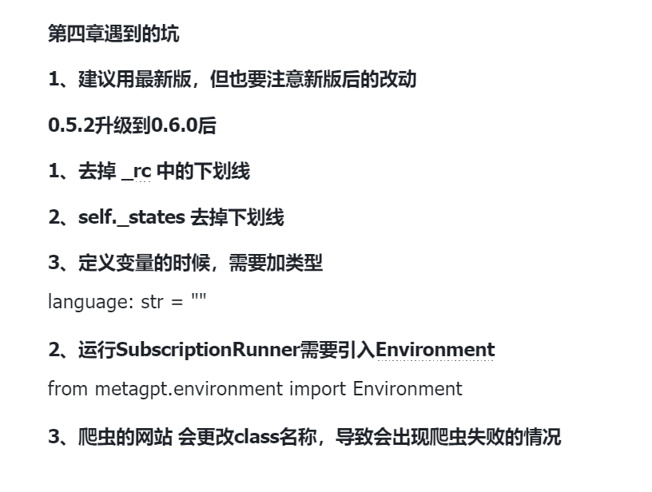

# MetaGPT 学习笔记

## Table of Contents
- [Chapter 1](#chapter-1-introduction)
- [Chapter 2](#chapter-2-agent)
- [Chapter 3](#chapter3)
- [Chapter 4](#chapter4)
- [Chapter 5](#chapter5)
- [Chapter 6](#chapter6)
# Chapter 1: Introduction 

<https://docs.deepwisdom.ai/main/zh/guide/get_started/introduction.html>

[《MetaGPT智能体开发入门》教程](https://deepwisdom.feishu.cn/docx/RJmTdvZuPozAxFxEpFxcbiPwnQf)

助教GPTs： <https://chat.openai.com/g/g-F4pnkAK5S-professional-tech-tutorial-assistant>


## 安装

**请确保你的系统已安装Python 3.9+**

```!shell
pip install metagpt
# pip install -i https://pypi.tuna.tsinghua.edu.cn/simple metagpt==0.5.2（推荐）
```


### 配置API：

> MetaGPT提供两种种配置OpenAI API key的方法，你可以将自己的OpenAI API key保存为环境变量，这样在你本地网络通畅的情况下（请确保你能够访问到openai）就可以直接使用OpenAI服务

```!shell
import os
os.environ["OPENAI_API_KEY"] = "sk-..."  # 填入你自己的OpenAI API key
os.environ["OPENAI_API_MODEL"] = "intended model" # 选择你要使用的模型，例如：gpt-4, gpt-3.5-turbo
os.environ["OPENAI_API_BASE"] = "https://api.openai-forward.com/v1"

```

同时MetaGPT还提供了利用`config.yaml`文件来配置OpenAI API服务的方法

1. 在当前项目的工作目录下，新建一个文件夹`config`并在该文件夹下添加一个`config.yaml`或`key.yaml`文件

2. 拷贝样例配置 [config.yaml](https://github.com/geekan/MetaGPT/blob/main/config/config.yaml) 中的内容到你的新文件中。

3. 在新文件内设置自己的OPENAI API KEY配置


**MetaGPT将会按照下述优先级来读取你的配置：`config/key.yaml > config/config.yaml > environment variable`**

### 尝试

```!shell
#  software startup example

import asyncio
from metagpt.roles import (
    Architect,
    Engineer,
    ProductManager,
    ProjectManager,
)
from metagpt.team import Team

async def startup(idea: str):
    company = Team()
    company.hire(
        [
            ProductManager(),
            Architect(),
            ProjectManager(),
            Engineer(),
        ]
    )
    company.invest(investment=3.0)
    company.start_project(idea=idea)

    await company.run(n_round=5)


asyncio.run(startup(idea="write a cli blackjack game")) # blackjack: 二十一点

```

在notebook中执行下面命令，运行并得到生成的游戏代码

```python
await startup(idea="write a cli blackjack game") # blackjack: 二十一点
```


## 补充
<details>
  <summary>协程与异步IO</summary>
  **[协程与异步IO](https://www.liujiangblog.com/course/python/83)**
  
   > **协程，又称微线程，英文名`Coroutine`**，是运行在单线程中的“并发”，协程相比多线程的一大优势就是省去了多线程之间的切换开销，获得了更高的运行效率。Python中的异步IO模块asyncio就是基本的协程模块。

   > **进程/线程：操作系统提供的一种并发处理任务的能力。**
   >
   > **协程：程序员通过高超的代码能力，在代码执行流程中人为的实现多任务并发，是单个线程内的任务调度技巧。**

   > **yield的语法规则是：在yield这里暂停函数的执行，并返回yield后面表达式的值（默认为None），直到被next()方法再次调用时，从上次暂停的yield代码处继续往下执行。**当没有可以继续next()的时候，抛出异常，该异常可被for循环处理。

   ```python
   def fib(n):
       a, b = 0, 1
       i = 0
       while i < n:
           yield b
           a, b = b, a+b
           i += 1
   
   f = fib(10)
   for item in f:
       print(item)
   ```

   > **每个生成器都可以执行send()方法，为生成器内部的yield语句发送数据**。此时yield语句不再只是`yield xxxx`的形式，还可以是`var = yield xxxx`的赋值形式。**它同时具备两个功能，一是暂停并返回函数，二是接收外部send()方法发送过来的值，重新激活函数，并将这个值赋值给var变量！**

   ```python
   def simple_coroutine():
       print('-> 启动协程')
       y = 10
       x = yield y
       print('-> 协程接收到了x的值:', x)
   
   my_coro = simple_coroutine()
   ret = next(my_coro)
   print(ret)
   my_coro.send(10)
   
   """
   1. `my_coro = simple_coroutine()` - 这行创建了协程的一个实例。
   
   2. `ret = next(my_coro)` - 使用 `next()` 函数开始协程的执行。协程会运行到第一个 `yield` 表达式，然后暂停，并返回 `y` 的值（10）。这个值被存储在变量 `ret` 中。
   
   3. `print(ret)` - 打印 `ret` 的值，结果应该是10。
   
   4. `my_coro.send(10)` - 这行将值10发送回协程。协程从 `yield` 语句处恢复执行，10被赋值给变量 `x`，然后协程继续执行直到完成。
   """
   ```

   > 因为send()方法的参数会成为暂停的yield表达式的值，所以，仅当协程处于暂停状态时才能调用 send()方法，例如`my_coro.send(10)`。不过，如果协程还没激活（状态是`'GEN_CREATED'`），就立即把None之外的值发给它，会出现TypeError。因此，始终要先调用`next(my_coro)`激活协程（也可以调用`my_coro.send(None)`），这一过程被称作预激活。

   > **@asyncio.coroutine：asyncio模块中的装饰器，用于将一个生成器声明为协程。**
   >
   > **yield from 其实就是等待另外一个协程的返回。**

   ```python
   def func():
       for i in range(10):
           yield i
   
   print(list(func()))
   
   ###########
   
   def func():
       yield from range(10)
   
   print(list(func()))
   ```

   ```python
   import asyncio
   import datetime
   
   @asyncio.coroutine  # 声明一个协程
   def display_date(num, loop):
       end_time = loop.time() + 10.0
       while True:
           print("Loop: {} Time: {}".format(num, datetime.datetime.now()))
           if (loop.time() + 1.0) >= end_time:
               break
           yield from asyncio.sleep(2)  # 阻塞直到协程sleep(2)返回结果
   loop = asyncio.get_event_loop()  # 获取一个event_loop
   tasks = [display_date(1, loop), display_date(2, loop)]
   loop.run_until_complete(asyncio.gather(*tasks))  # "阻塞"直到所有的tasks完成
   loop.close()
   ```

   > Python3.5中对协程提供了更直接的支持，引入了`async/await`关键字。上面的代码可以这样改写：使用`async`代替`@asyncio.coroutine`，使用`await`代替`yield from`，代码变得更加简洁可读。从Python设计的角度来说，`async/await`让协程独立于生成器而存在，不再使用yield语法。

   ```python
   import asyncio
   import datetime
   
   async def display_date(num, loop):      # 注意这一行的写法
       end_time = loop.time() + 10.0
       while True:
           print("Loop: {} Time: {}".format(num, datetime.datetime.now()))
           if (loop.time() + 1.0) >= end_time:
               break
           await asyncio.sleep(2)  # 阻塞直到协程sleep(2)返回结果
   
   loop = asyncio.get_event_loop()  # 获取一个event_loop
   tasks = [display_date(1, loop), display_date(2, loop)]
   loop.run_until_complete(asyncio.gather(*tasks))  # "阻塞"直到所有的tasks完成
   loop.close()
   ```

   > asyncio的使用可分三步走：
   >
   > 1. 创建事件循环
   >
   > 2. 指定循环模式并运行
   >
   > 3. 关闭循环
   >
   > 通常我们使用`asyncio.get_event_loop()`方法创建一个循环。

   > 运行循环有两种方法：一是调用`run_until_complete()`方法，二是调用`run_forever()`方法。`run_until_complete()`内置`add_done_callback`回调函数，`run_forever()`则可以自定义`add_done_callback()`

</details>

# Chapter 2: Agent

[【直播回放】MetaGPT作者深度解析直播回放\_哔哩哔哩\_bilibili](https://www.bilibili.com/video/BV1Ru411V7XL/?spm_id_from=333.337.search-card.all.click)

[基于大语言模型的AI Agents—Part 1 | ](https://www.breezedeus.com/article/ai-agent-part1)[Breezedeus.com](Breezedeus.com)

What is Agent: according to MG

> 智能体 = LLM+观察+思考+行动+记忆
>
> 多智能体 = 智能体+环境+SOP+评审+路由+订阅+经济


# <a id="chapter3"></a>Chapter 3: MetaGPT框架组件介绍

在MetaGPT看来，可以将智能体想象成环境中的数字人，其中

> 智能体 = 大语言模型（LLM） + 观察 + 思考 + 行动 + 记忆


> **在MetaGPT内 `Role` 类是智能体的逻辑抽象**

## Action
<details>
  <summary>源码</summary>


   <https://github.com/geekan/MetaGPT/blob/main/metagpt/actions/action.py>

   这段代码定义了一个Python类的继承体系，用于创建和注册不同种类的“行动”或任务，这些任务能够与LLM交互。代码中类和功能的作用如下：

   1. `action_subclass_registry`：这是一个字典，用于保存所有从`Action`基类继承的子类。

   2. `Action` 类：这是一个基础类，表示一个通用的行动。它们带有以下属性：

      - `name`: 行动的名称。

      - `llm`: 和LLM的接口。默认情况下，此处使用`LLM`类的实例，但通过设置为`exclude=True`来避免在`dict`输出中包括此字段。

      - `context`: 行动的上下文，可以是各种类型，用于行动的执行。

      - `prefix`: 系统消息的前缀。在函数`set_prefix`中被使用。

      - `desc`: 行动描述，用于技能管理。

      - `node`: `ActionNode` 类的实例，用于具体定义行动的结构和行为。

      - `builtin_class_name`: 类的名称，子类的名称会自动设置为此变量的值。

   3. `__init_with_instruction` 方法：初始化方法，用于根据指令创建`ActionNode`实例。

   4. `__init__` 方法：覆盖基类的初始化方法。除了父类的初始化外，还动态地反序列化子类，并注册其类名。如果提供了`instruction`参数，还会调用`__init_with_instruction`方法。

   5. `__init_subclass__` 方法：当创建`Action`的子类时自动调用，将子类注册到`action_subclass_registry`字典中。

   6. `dict` 方法：覆盖基类的`dict`方法，从返回的字典中移除`llm`属性。

   7. `set_prefix` 方法：用于设置消息前缀，并更新相关的`llm`系统提示和`node`的`llm`属性。

   8. `__str__` 和 `__repr__` 方法：定义类实例的字符串表示，方便打印和调试。

   9. `_aask` 方法：异步发送提示到`llm`，通常用于获取模型生成的文本。这个方法默认附加了`prefix`属性作为系统消息。

   10. `_run_action_node` 方法：异步运行与`ActionNode`相关的逻辑，这通常涉及使用上下文信息和`llm`与具体的节点交互。

   11. `run` 方法：是一个异步方法，通常由子类实现具体的行动。如果`node`被设置，则会使用`_run_action_node`处理相关逻辑，否则会提示未实现错误。

</details>   

   

简单例子：simpleCoder

````python
import re
import asyncio
from metagpt.actions import Action

class SimpleWriteCode(Action):

    PROMPT_TEMPLATE = """
    Write a python function that can {instruction} and provide two runnnable test cases.
    Return ```python your_code_here ``` with NO other texts,
    your code:
    """

    def __init__(self, name="SimpleWriteCode", context=None, llm=None):
        super().__init__(name, context, llm)

    async def run(self, instruction: str):

        prompt = self.PROMPT_TEMPLATE.format(instruction=instruction)

        rsp = await self._aask(prompt)

        code_text = SimpleWriteCode.parse_code(rsp)

        return code_text

    @staticmethod
    def parse_code(rsp):
        pattern = r'```python(.*)```'
        match = re.search(pattern, rsp, re.DOTALL)
        code_text = match.group(1) if match else rsp
        return code_text
````


## Message


<details>
  <summary>源码</summary>


   <https://github.com/geekan/MetaGPT/blob/main/metagpt/schema.py>

   `Message` 类用于表示消息数据，并提供了多种方法来处理消息内容和属性。
</details>  


## Role

<details>
  <summary>源码</summary>

   <https://github.com/geekan/MetaGPT/blob/main/metagpt/roles/role.py>

   run 方法： 

   > 如果有入参message就将message添加到role的记忆中如果没有入参就观察环境中的新消息

   ```python
   async def run(self, message=None):
       """Observe, and think and act based on the results of the observation
           观察，并根据观察结果进行思考和行动。"""
       if message:
           if isinstance(message, str):
               message = Message(message)
           if isinstance(message, Message):
               self.recv(message)
           if isinstance(message, list):
               self.recv(Message("\n".join(message)))
            '''如果message存在，它会检查message的类型，
               如果是字符串，则将其转换为Message对象；
               如果是Message对象，则直接调用recv方法；
               如果是列表，则将列表中的消息合并成一个新的消息，然后再调用recv方法。
               相当于预处理将入参转化为Message对象并添加到role的记忆中'''
       elif not await self._observe():
           # If there is no new information, suspend and wait
           logger.debug(f"{self._setting}: no news. waiting.")
           return
   
       rsp = await self.react()
       # Publish the reply to the environment, waiting for the next subscriber to process
       self._publish_message(rsp)
       return rsp
   
   ```

   本质：Observe, and think and act based on the results of the observation （即ReAct）

   ```python
   async def react(self) -> Message:
       """Entry to one of three strategies by which Role reacts to the observed Message
           通过观察到的消息，角色对其中一种策略进行反应。"""
       if self._rc.react_mode == RoleReactMoRoleReactMode.REACTde.REACT:
           rsp = await self._react()
       elif self._rc.react_mode == RoleReactMode.BY_ORDER:
           rsp = await self._act_by_order()
       elif self._rc.react_mode == RoleReactMode.PLAN_AND_ACT:
           rsp = await self._plan_and_act()
       self._set_state(state=-1) # current reaction is complete, reset state to -1 and todo back to None
       return rsp
   
   
   async def _react(self) -> Message:
           """Think first, then act, until the Role _think it is time to stop and requires no more todo.
           This is the standard think-act loop in the ReAct paper, which alternates thinking and acting in task solving, i.e. _think -> _act -> _think -> _act -> ... 
           Use llm to select actions in _think dynamically
           """
           actions_taken = 0
           rsp = Message("No actions taken yet") # will be overwritten after Role _act
           while actions_taken < self._rc.max_react_loop:
               # think
               await self._think()
               if self._rc.todo is None:
                   break
               # act
               logger.debug(f"{self._setting}: {self._rc.state=}, will do {self._rc.todo}")
               rsp = await self._act()
               actions_taken += 1
           return rsp # return output from the last action
   ```
</details> 
   

   

例子：  

```python
class SimpleCoder(Role):
    def __init__(
        self,
        name: str = "Alice",
        profile: str = "SimpleCoder",
        **kwargs,
    ):
        super().__init__(name, profile, **kwargs)
        self._init_actions([SimpleWriteCode])

    async def _act(self) -> Message:
        logger.info(f"{self._setting}: ready to {self._rc.todo}")
        todo = self._rc.todo  # todo will be SimpleWriteCode()

        msg = self.get_memories(k=1)[0]  # find the most recent messages

        code_text = await todo.run(msg.content)
        msg = Message(content=code_text, role=self.profile,
                      cause_by=type(todo))

        return msg
```


## 实现：技术文档助手

> 因为token限制的原因，我们先通过 `LLM` 大模型生成教程的目录，再对目录按照二级标题进行分块，对于每块目录按照标题生成详细内容，最后再将标题和内容进行拼接，解决 `LLM` 大模型长文本的限制问题。


1. Action: `WriteDirectory`

   根据用户需求生成文章大纲

   prompt 参考：

   ```python
   COMMON_PROMPT = """
           You are now a seasoned technical professional in the field of the internet. 
           We need you to write a technical tutorial with the topic "{topic}".
           您现在是互联网领域的经验丰富的技术专业人员。
           我们需要您撰写一个关于"{topic}"的技术教程。
           """
   
   DIRECTORY_PROMPT = COMMON_PROMPT + """
           Please provide the specific table of contents for this tutorial, strictly following the following requirements:
           1. The output must be strictly in the specified language, {language}.
           2. Answer strictly in the dictionary format like {{"title": "xxx", "directory": [{{"dir 1": ["sub dir 1", "sub dir 2"]}}, {{"dir 2": ["sub dir 3", "sub dir 4"]}}]}}.
           3. The directory should be as specific and sufficient as possible, with a primary and secondary directory.The secondary directory is in the array.
           4. Do not have extra spaces or line breaks.
           5. Each directory title has practical significance.
           请按照以下要求提供本教程的具体目录：
           1. 输出必须严格符合指定语言，{language}。
           2. 回答必须严格按照字典格式，如{{"title": "xxx", "directory": [{{"dir 1": ["sub dir 1", "sub dir 2"]}}, {{"dir 2": ["sub dir 3", "sub dir 4"]}}]}}。
           3. 目录应尽可能具体和充分，包括一级和二级目录。二级目录在数组中。
           4. 不要有额外的空格或换行符。
           5. 每个目录标题都具有实际意义。
           """
   ```

   而后，根据LLM的rsp: str, 通过`extract_struct` function extract 相应的数据结构，如：

   ```python
   
   >>> text = 'xxx {"x": 1, "y": {"a": 2, "b": {"c": 3}}} xxx'
   >>> result_dict = OutputParser.extract_struct(text, "dict")
   >>> print(result_dict)
   >>> # Output: {"x": 1, "y": {"a": 2, "b": {"c": 3}}}
   ```

2. Action: `WriteContent`

   根据传入的子标题来生成内容

   参考prompt：

   ```python
   COMMON_PROMPT = """
           You are now a seasoned technical professional in the field of the internet. 
           We need you to write a technical tutorial with the topic "{topic}".
           """
           CONTENT_PROMPT = COMMON_PROMPT + """
           Now I will give you the module directory titles for the topic. 
           Please output the detailed principle content of this title in detail. 
           If there are code examples, please provide them according to standard code specifications. 
           Without a code example, it is not necessary.
   
           The module directory titles for the topic is as follows:
           {directory}
   
           Strictly limit output according to the following requirements:
           1. Follow the Markdown syntax format for layout.
           2. If there are code examples, they must follow standard syntax specifications, have document annotations, and be displayed in code blocks.
           3. The output must be strictly in the specified language, {language}.
           4. Do not have redundant output, including concluding remarks.
           5. Strict requirement not to output the topic "{topic}".
           现在我将为您提供该主题的模块目录标题。
           请详细输出此标题的详细原理内容。
           如果有代码示例，请按照标准代码规范提供。
           没有代码示例则不需要提供。
           
           该主题的模块目录标题如下：
           {directory}
           
           严格按照以下要求限制输出：
           1. 遵循Markdown语法格式进行布局。
           2. 如果有代码示例，必须遵循标准语法规范，具备文档注释，并以代码块形式显示。
           3. 输出必须严格使用指定语言{language}。
           4. 不得有冗余输出，包括总结性陈述。
           5. 严禁输出主题"{topic}"。
           """
   ```

3. Role: `TutorialAssistant`

   ReAct

   流程：

   

Before running the code, create a config folder in the path where the code will be executed, and place the config.yaml file containing information such as the OpenAI API key into it.

code: [simple coder](./code/agent101_simple_coder.ipynb)

code: [tutorial Assistant & homework](./code/agent101_TutorialAssistant.ipynb)


# <a id="chapter4"></a>Chapter 4: 订阅智能体

## Introduction

定义：

> 让Agent为我们关注某些想关注的信息，当有我们关注的事件发生时，Agent获取信息并进行处理，然后通过一些如邮件、微信、discord等通知渠道将处理后的信息发送给我们，我们将这类Agent称为订阅智能体

action： **从外界信息源中搜集信息**和**对搜集得到的信息进行总结**

额外功能： **定时运行**的功能和发送到**通知渠道**的功能


`metagpt.subscription`模块提供了`SubscriptionRunner`类

```python
>>> import asyncio
>>> from metagpt.subscription import SubscriptionRunner
>>> from metagpt.roles import Searcher
>>> from metagpt.schema import Message

>>> async def trigger():
...     while True:
...         yield Message("the latest news about OpenAI")
...         await asyncio.sleep(3600 * 24)

>>> async def callback(msg: Message):
...     print(msg.content)

>>> async def main():
...     pb = SubscriptionRunner()
...     await pb.subscribe(Searcher(), trigger(), callback)
...     await pb.run()

>>> asyncio.run(main())
```

> 订阅智能体的实现主要有3个要素，分别是Role、Trigger、Callback，即智能体本身、触发器、数据回调


## 实现OOS 订阅智能体

OSS(Open Source Software)
基本概念补充
<details>
  <summary>HTML</summary>
  HTML（超文本标记语言）是用于创建网页的标准标记语言。它的基本结构包括以下几个部分：

  1. **文档类型声明（Doctype）**：它声明了文档的类型和 HTML 的版本，例如 `<!DOCTYPE html>` 表明该文档是 HTML5。

  2. **HTML 标签**：文档开始和结束的地方，分别用 `<html>` 和 `</html>` 表示。

  3. **头部（Head）区域**：

     - `<head>` 标签包含了文档的元数据，如字符集定义 `<meta charset="UTF-8">`。

     - `<title>` 标签定义了文档的标题，显示在浏览器的标题栏或页面的标签页上。

     - 链接外部资源，如样式表 `<link rel="stylesheet" href="styles.css">`。

  4. **主体（Body）区域**：这是文档的主要内容部分，使用 `<body>` 和 `</body>` 标签包裹。

     - **文本内容**：如 `<h1>` 到 `<h6>` 用于标题，`<p>` 用于段落。

     - **链接**：`<a href="url">` 用来创建超链接。

     - **图像**：`` 用于嵌入图像。

     - **列表**：有序列表 `<ol>` 和无序列表 `<ul>`，列表项用 `<li>` 表示。

     - **表格**：由 `<table>` 创建，内部包含 `<tr>`（行）、`<td>`（单元格）等元素。

     - **表单**：`<form>` 用于收集用户输入，内部包含输入字段 `<input>`、按钮 `<button>` 等。

  5. **注释**：使用 `<!-- 注释内容 -->` 来添加注释，注释不会显示在浏览器中。

  HTML 包含更多的标签和属性，可以用来创建丰富和动态的网页内容。
</details> 
<details>
    <summary>CSS</summary>

  CSS（层叠样式表）在 HTML 中的作用主要是用来定义网页的样式。它提供了一种强大的方式来控制网页的布局和外观。以下是 CSS 在 HTML 中的几个关键作用：

  1. **格式化文本**：CSS 可以改变文本的大小、颜色、字体、行间距等。例如，可以指定段落文字的字体大小和颜色。

  2. **布局控制**：CSS 使得创建复杂的页面布局成为可能。它可以控制元素的位置、大小、外边距（margin）、内边距（padding）等。例如，可以用 CSS 设定两列或三列布局。

  3. **页面响应式设计**：通过媒体查询（Media Queries），CSS 可以根据不同的屏幕大小和设备特性应用不同的样式规则。这对于制作在手机、平板电脑和桌面电脑上都能良好显示的网页非常重要。

  4. **网页美化**：CSS 提供了丰富的视觉效果，如背景颜色和图像、边框样式、阴影效果、动画等。这些都可以用来增强网页的视觉吸引力和用户体验。

  5. **页面一致性**：通过使用外部样式表，可以确保整个网站的一致性。对外部样式表的任何修改都会在所有连接到该样式表的 HTML 页面上反映出来，使得维护和更新网站样式更加高效。

  6. **与 HTML 的分离**：将样式信息与 HTML 结构分离，使得 HTML 代码更加清晰，也更容易维护和管理。

  在 HTML 中，可以通过以下三种方式来应用 CSS：

  - **内联样式**：直接在 HTML 元素上使用 `style` 属性。

  - **内部样式表**：在 HTML 文档的 `<head>` 部分使用 `<style>` 标签。

  - **外部样式表**：使用 `<link>` 标签链接到一个外部的 CSS 文件。

  CSS 的强大和灵活性使其成为网页设计和前端开发中不可或缺的工具。
</details>

<details>
  <summary>aiohttp</summary>

  `aiohttp` 是一个基于异步 I/O（输入/输出）的 Python 库，用于客户端和服务器端的 HTTP 网络通信。使用 `aiohttp` 可以高效地处理大量并发的 HTTP 请求。下面是使用 `aiohttp` 发起网络请求的基本步骤：

  ### 安装 aiohttp

  首先，确保安装了 `aiohttp` 库。如果还没有安装，可以通过 pip 进行安装：

  ```bash
  pip install aiohttp
  ```

  ### 异步 HTTP 客户端的基本用法

  #### 导入库

  ```python
  import aiohttp
  import asyncio
  ```

  #### 发起 GET 请求

  使用 `aiohttp.ClientSession()` 创建一个会话，然后使用 `session.get(url)` 发起 GET 请求。

  ```python
  async def fetch(session, url):
      async with session.get(url) as response:
          return await response.text()
  
  async def main():
      async with aiohttp.ClientSession() as session:
          html = await fetch(session, 'http://python.org')
          print(html)
  
  asyncio.run(main())
  ```

  #### 发起 POST 请求

  类似于 GET 请求，使用 `session.post(url, data=...)` 发起 POST 请求。

  ```python
  async def post_data(session, url, data):
      async with session.post(url, data=data) as response:
          return await response.text()
  
  async def main():
      async with aiohttp.ClientSession() as session:
          data = {'key': 'value'}
          response = await post_data(session, 'http://httpbin.org/post', data)
          print(response)
  
  asyncio.run(main())
  ```

  #### 处理异常

  在网络请求过程中，处理可能出现的异常是一个好习惯。

  ```python
  async def fetch_with_error_handling(session, url):
      try:
          async with session.get(url) as response:
              return await response.text()
      except aiohttp.ClientError as e:
          print(f"A network-related error occurred: {e}")
      except Exception as e:
          print(f"An unexpected error occurred: {e}")
  
  # 使用此函数与上述示例中的 main 函数一起
  ```

  ### 注意事项

  - 使用异步代码时，所有与网络请求相关的操作都应该在 `async` 函数内执行。

  - `asyncio.run(main())` 是启动异步程序的标准方式。

  - 确保在异步函数中处理异常，以避免程序意外崩溃。

  这些是 `aiohttp` 的基本用法。通过它，你可以高效地在 Python 中处理 HTTP 请求。由于其异步特性，`aiohttp` 特别适用于需要高并发的应用场景。
</details>


### Role: OSSWatcher 实现

定位：**帮我们关注并分析热门的开源项目，当有相关信息时将信息推送给我们，这里需要确定让 OSS 从哪个网页获取信息**

两个action：**爬取热门开源项目**和**分析热门开源项目**。

#### GitHub Trending爬取

参考：<https://chat.openai.com/share/6c8046d3-e363-40bd-9412-8d859e7b3854>

#### GitHub Trending总结

````python
TRENDING_ANALYSIS_PROMPT = """# Requirements
You are a GitHub Trending Analyst, aiming to provide users with insightful and personalized recommendations based on the latest
GitHub Trends. Based on the context, fill in the following missing information, generate engaging and informative titles, 
ensuring users discover repositories aligned with their interests.

# The title about Today's GitHub Trending
## Today's Trends: Uncover the Hottest GitHub Projects Today! Explore the trending programming languages and discover key domains capturing developers' attention. From ** to **, witness the top projects like never before.
## The Trends Categories: Dive into Today's GitHub Trending Domains! Explore featured projects in domains such as ** and **. Get a quick overview of each project, including programming languages, stars, and more.
## Highlights of the List: Spotlight noteworthy projects on GitHub Trending, including new tools, innovative projects, and rapidly gaining popularity, focusing on delivering distinctive and attention-grabbing content for users.
---
# Format Example

```
# [Title]

## Today's Trends
Today, ** and ** continue to dominate as the most popular programming languages. Key areas of interest include **, ** and **.
The top popular projects are Project1 and Project2.

## The Trends Categories
1. Generative AI
    - [Project1](https://github/xx/project1): [detail of the project, such as star total and today, language, ...]
    - [Project2](https://github/xx/project2): ...
...

## Highlights of the List
1. [Project1](https://github/xx/project1): [provide specific reasons why this project is recommended].
...
```

---
# Github Trending
{trending}
"""
````


#### OSSWatcher Role

加入`CrawlOSSTrending` 和 `AnalysisOSSTrending` 两个action

```python
from metagpt.roles import Role

class OssWatcher(Role):
    def __init__(
        self,
        name="Codey",
        profile="OssWatcher",
        goal="Generate an insightful GitHub Trending analysis report.",
        constraints="Only analyze based on the provided GitHub Trending data.",
    ):
        super().__init__(name, profile, goal, constraints)
        self._init_actions([CrawlOSSTrending, AnalysisOSSTrending])
        self._set_react_mode(react_mode="by_order")

    async def _act(self) -> Message:
        logger.info(f"{self._setting}: ready to {self._rc.todo}")
        # By choosing the Action by order under the hood
        # todo will be first SimpleWriteCode() then SimpleRunCode()
        todo = self._rc.todo

        msg = self.get_memories(k=1)[0] # find the most k recent messages
        result = await todo.run(msg.content)

        msg = Message(content=str(result), role=self.profile, cause_by=type(todo))
        self._rc.memory.add(msg)
        return msg
```


### Trigger

使用crontab 实现定时触发

使用`aiocron`我们可以直接使用cron的语法制定定时任务

```python
# 结合aiocron使用类的方式，来实现定时Trigger

import time
from aiocron import crontab
from typing import Optional
from pytz import BaseTzInfo
from pydantic import BaseModel, Field
from metagpt.schema import Message


class OssInfo(BaseModel):
    url: str
    timestamp: float = Field(default_factory=time.time)


class GithubTrendingCronTrigger():

    def __init__(self, spec: str, tz: Optional[BaseTzInfo] = None, url: str = "https://github.com/trending") -> None:
        self.crontab = crontab(spec, tz=tz)
        self.url = url

    def __aiter__(self):
        return self

    async def __anext__(self):
        await self.crontab.next()
        return Message(self.url, OssInfo(url=self.url))
```

```python
# 创建 GithubTrendingCronTrigger 实例，指定每天 UTC 时间 10:00 AM 触发
cron_trigger = GithubTrendingCronTrigger("0 10 * * *")
```

**思考题**
<details>
  <summary>思考1</summary>
  如果需要榜单更新再推送，可以如何实现？

   对之前的榜单数据用hash 函数计算hash值， 并保存在本地；

   每一次`CrawlOSSTrending`计算一次hash值，比对前后hash值是否相等

   即：

   ```python
   # 初始化变量
   prev_hash = None
   
   # 无限循环，定时执行CrawlOSSTrending
   while True:
     # 调用函数CrawlOSSTrending以获取最新的榜单数据
     msg_now = CrawlOSSTrending()
   
     # 计算当前数据的hash值
     now_hash = hash(msg_now)
   
     # 比对前后hash值是否相等
     if prev_hash is not None and prev_hash != now_hash:
       # 如果hash不相同，则执行analysis
       AnalysisOSSTrending(msg_now)
   
     # 将当前hash值存为“前一次的hash值”，以便下次循环时使用
     prev_hash = now_hash
   
     # 等待一定时间后再次执行循环（时间根据实际情况设定）
     Sleep(some_time_period)
     
   ```
</details>
<details>
  <summary>思考2</summary>
  Crontab的定时方式可能不是很方便进行调试，有什么方便调试的方法吗？

   ```python
   from pytz import timezone
   ## test
   
   async def test_cron_trigger(cron_trigger):
       async for message in cron_trigger:
           print(message)
           break  # 为了测试，我们在接收到第一个消息后就退出循环
   
   
   
   current_time = datetime.now()
   target_time = current_time + timedelta(minutes=1)
   cron_expression = target_time.strftime('%M %H %d %m %w')
   print(cron_expression)
   
   # trigger_after 1 min
   beijing_tz = timezone('Asia/Shanghai')  #获取北京时间的时区
   cron_trigger = GithubTrendingCronTrigger(cron_expression, tz=beijing_tz)
   
   # 启动异步测试
   await test_cron_trigger(cron_trigger)
   ```
</details>


### Callback

实现agent将数据发送至Discord

注册账号

在[discord的开发者面板](https://discord.com/developers/applications)添加BOT

将BOT添加到某个服务器中

参考：

<https://discordpy.readthedocs.io/en/stable/discord.html>

<https://realpython.com/how-to-make-a-discord-bot-python/>

token获取[discord readthedocs](https://discordpy.readthedocs.io/en/stable/discord.html)

DISCORD_CHANNEL_ID： 注意**是频道ID不是服务器ID！**


```python
import os
from environs import load_dotenv

load_dotenv('.env')

TOKEN = os.getenv('DISCORD_TOKEN')
CHANNEL_ID = os.getenv('DISCORD_CHANNEL_ID')
proxy = os.getenv('global_proxy')

# callback
import os
import discord
async def discord_callback(msg: Message):
    intents = discord.Intents.default()
    intents.message_content = True
    intents.members = True

    client = discord.Client(intents=intents, proxy=proxy)
    token = os.environ["DISCORD_TOKEN"]
    channel_id = int(os.environ["DISCORD_CHANNEL_ID"])

    async with client:
        await client.login(token)
        channel = await client.fetch_channel(channel_id)
        lines = []
        for i in msg.content.splitlines():
            if i.startswith(("# ", "## ", "### ")):
                if lines:
                    await channel.send("\n".join(lines))
                    lines = []
            lines.append(i)

        if lines:
            await channel.send("\n".join(lines))
```

效果：


## Code 实现

完整OSS watcher代码实现: [ossWatcher](./code/agent101_ossWatcher.ipynb)


### Homework


huggingface daily paper watcher: [HFDailyPaperWatcher](./code/agent101_chapter4_homework_HFDailyPaperWatcher.ipynb)


效果：


#### 1\. Fetch Daily paper 

1. 首先爬取主页面获得每个paper的title和对应href

   ```python
   async def parse_main_page(html):
       title_list = []
       href_list = []
       soup = BeautifulSoup(html, 'html.parser')
       # 更新查找标签的逻辑以匹配当前网页结构
       title_tags = soup.find_all('h3', class_='mb-1 text-lg font-semibold leading-[1.2] hover:underline peer-hover:underline md:text-2xl')
       for title_tag in title_tags:
           a_tag = title_tag.find('a')  # 标题内的<a>标签
           if a_tag:
               title = a_tag.text.strip()  # 清除空白字符得到标题文本
               href = a_tag['href']  # 提取href属性
               title_list.append(title)  # 添加标题到列表
               href_list.append(href)  # 添加链接到列表
       return title_list, href_list
   ```

2. 根据上一部获得的title和对应href， 遍历获取子页面的paper abstract 信息， 其中子页面url为 base_url+href

   ```python
   async def parse_sub_page(html):
       soup = BeautifulSoup(html, 'html.parser')
       abstract = soup.find('div', class_="pb-8 pr-4 md:pr-16").p.text
       arxiv_url = soup.find('a', class_="btn inline-flex h-9 items-center", href=True)['href']
       return abstract, arxiv_url
   
   async def main():
       url = 'https://huggingface.co/papers'
       base_url = 'https://huggingface.co'
       repositories = []
       try:
           html = await fetch_html(url)
           title_list, href_list = await parse_main_page(html)
   
           for title, href in zip(title_list, href_list):
               repo_info = {}
               repo_info['title'] = title
               # repo_info['href'] = href
               repositories.append(repo_info)
               # print(title, href)
               sub_html = await fetch_html(base_url + href)
               abstract, arxiv_url = await parse_sub_page(sub_html)
               # print(abstract, arxiv_url)
               repo_info['abstract'] = abstract
               repo_info['arxiv_url'] = arxiv_url
               repositories.append(repo_info)
           return repositories
       except Exception as e:
           print(f"An error occurred: {e}")
   ```

   这一步将获取当天所有paper信息， 并返回一个dict， 包含paper 的title， abstract， 和 Arxiv url

   如下：

   ```shell
   [{'title': 'InstantID: Zero-shot Identity-Preserving Generation in Seconds',
     'abstract': 'There has been significant progress in personalized image synthesis with\nmethods such as Textual Inversion, DreamBooth, and LoRA. Yet, their real-world\napplicability is hindered by high storage demands, lengthy fine-tuning\nprocesses, and the need for multiple reference images. Conversely, existing ID\nembedding-based methods, while requiring only a single forward inference, face\nchallenges: they either necessitate extensive fine-tuning across numerous model\nparameters, lack compatibility with community pre-trained models, or fail to\nmaintain high face fidelity. Addressing these limitations, we introduce\nInstantID, a powerful diffusion model-based solution. Our plug-and-play module\nadeptly handles image personalization in various styles using just a single\nfacial image, while ensuring high fidelity. To achieve this, we design a novel\nIdentityNet by imposing strong semantic and weak spatial conditions,\nintegrating facial and landmark images with textual prompts to steer the image\ngeneration. InstantID demonstrates exceptional performance and efficiency,\nproving highly beneficial in real-world applications where identity\npreservation is paramount. Moreover, our work seamlessly integrates with\npopular pre-trained text-to-image diffusion models like SD1.5 and SDXL, serving\nas an adaptable plugin. Our codes and pre-trained checkpoints will be available\nat https://github.com/InstantID/InstantID.',
     'arxiv_url': 'https://arxiv.org/abs/2401.07519'},
   ...
   ]
   ```

#### 2\. Action

将以上动作修改成`Action`：  `CrawlHuggingfaceDailyPaper`

将当天paper整理成dict，用于下一步动作

```python
from metagpt.actions.action import Action
from metagpt.config import CONFIG

class CrawlHuggingfaceDailyPaper(Action):
    """
    This class specifically targets the daily papers section of the Huggingface website.
    Its main functionality includes asynchronously fetching and parsing the latest research papers
    published on Huggingface, extracting relevant details such as titles, abstracts, and arXiv URLs.
    It can be utilized in applications where up-to-date research information from Huggingface
    is required, making it a valuable tool for researchers and developers in AI and machine learning.
    """

    async def run(self, url: str = "https://huggingface.co/papers"):
        async with aiohttp.ClientSession() as client:
            async with client.get(url, proxy=CONFIG.global_proxy) as response:
                response.raise_for_status()
                html = await response.text()

        title_list, href_list = await parse_main_page(html)

        repositories = []
        base_url = 'https://huggingface.co'

        for title, href in zip(title_list, href_list):
            repo_info = {'title': title}
            sub_html = await fetch_html(base_url + href)
            abstract, arxiv_url = await parse_sub_page(sub_html)
            repo_info['abstract'] = abstract
            repo_info['arxiv_url'] = arxiv_url

            repositories.append(repo_info)

        return repositories

```

接下来定义另一个action： SummaryDailyPaper， 将每一篇paper信息使用LLM进行改写： 

- 修改成markdown 格式

- 增加论文关键词提取

````python
from typing import Any
PAPER_SUMMARY_PROMPT = """
    Transform the given data about a research paper into a neat Markdown format. Also, identify and include five relevant keywords that best represent the core themes of the paper.
    The provided data is:
    ```
    {data}
    ```
    Please create a markdown summary and suggest five keywords related to this paper.
    """
class SummaryDailyPaper(Action):

    async def run(
        self,
        data: Any
    ):
        return await self._aask(PAPER_SUMMARY_PROMPT.format(data=data))
````


为什么不直接总结所有paper： **LLM上下文长度限制**


#### 3\. Role

接下来，定义一个角色`Role`: `DailyPaperWatcher`, 具备以上两个`Action`： `SummaryDailyPaper`,`CrawlHuggingfaceDailyPaper`

最简单版本

```python
from typing import Dict, List
from metagpt.utils.common import OutputParser
from metagpt.roles import Role
from metagpt.schema import Message
from metagpt.logs import logger

class DailyPaperWatcher(Role):
    def __init__(
        self,
        name="Huggy",
        profile="DailyPaperWatcher",
        goal="Generate a summary of Huggingface daily papers.",
        constraints="Only analyze based on the provided Huggingface daily papers.",
    ):
        super().__init__(name, profile, goal, constraints)
        self._init_actions([CrawlHuggingfaceDailyPaper])
        self._set_react_mode(react_mode="by_order")

    
    async def _act(self) -> Message:
        logger.info(f"{self._setting}: ready to {self._rc.todo}")

        todo = self._rc.todo

        try:
            msg = self.get_memories(k=1)[0]
        except IndexError:
            logger.error("No messages in memory")
            return Message(content="Error: No messages in memory", role=self.profile)

        try:
            result = await todo.run(msg.content)
            if isinstance(todo, CrawlHuggingfaceDailyPaper):
                # 针对每篇论文创建并执行 SummaryDailyPaper 动作
                logger.info(f"Preparing to summarize {len(result)} papers")
                msg_content = ''
                for paper in result:
                    summary_action = SummaryDailyPaper(paper)
                    summary_result = await summary_action.run(paper)
                    summary_msg = Message(content=str(summary_result), role=self.profile, cause_by=type(summary_action))
                    self._rc.memory.add(summary_msg)
                    msg_content += str(summary_result)
                    msg_content += '\n'

            else:
                msg = Message(content=str(result), role=self.profile, cause_by=type(todo))
                self._rc.memory.add(msg)

        except Exception as e:
            logger.error(f"Error during action execution: {e}")
            return Message(content=f"Error: {e}", role=self.profile)

        return Message(content=str(msg_content), role=self.profile, cause_by=type(todo))

```


几个小问题SummaryDailyPaper 总结时随机性丢失link（大概是prompt的问题）

使用一个for循环调用了SummaryDailyPaper， 应该有更优雅的方法


#### 4\. Trigger

基本没有太大变化

```python
import time
from aiocron import crontab
from typing import Optional
from pytz import BaseTzInfo
from pydantic import BaseModel, Field
from metagpt.schema import Message

class DailyPaperInfo(BaseModel):
    url: str
    timestamp: float = Field(default_factory=time.time)


class HuggingfaceDailyPaperCronTrigger():

    def __init__(self, spec: str, tz: Optional[BaseTzInfo] = None, url: str = "https://huggingface.co/papers") -> None:
        self.crontab = crontab(spec, tz=tz)
        self.url = url

    def __aiter__(self):
        return self

    async def __anext__(self):
        await self.crontab.next()
        return Message(self.url, DailyPaperInfo(url=self.url))

```

#### 5\. Callback

```python
# callback
import os
import discord
async def discord_callback(msg: Message):
    intents = discord.Intents.default()
    intents.message_content = True
    intents.members = True

    client = discord.Client(intents=intents)
    token = TOKEN
    channel_id = int(CHANNEL_ID)

    async with client:
        await client.login(token)
        channel = await client.fetch_channel(channel_id)
        lines = []
        for i in msg.content.splitlines():
            if i.startswith(("# ", "## ", "### ")):
                if lines:
                    await channel.send("\n".join(lines))
                    lines = []
            lines.append(i)

        if lines:
            await channel.send("\n".join(lines))
```


#### 6\. main

```python
from metagpt.subscription import SubscriptionRunner
# 运行入口，
async def main(spec: str = "54 16 * * *", discord: bool = True, wxpusher: bool = False):
    callbacks = []
    if discord:
        callbacks.append(discord_callback)

    if wxpusher:
        callbacks.append(wxpusher_callback)

    if not callbacks:
        async def _print(msg: Message):
            print(msg.content)
        callbacks.append(_print)

    async def callback(msg):
        await asyncio.gather(*(call(msg) for call in callbacks))

    runner = SubscriptionRunner()
    await runner.subscribe(DailyPaperWatcher(), HuggingfaceDailyPaperCronTrigger(spec), callback)
    await runner.run()

## test
from pytz import timezone
from datetime import datetime, timedelta

current_time = datetime.now()
target_time = current_time + timedelta(minutes=1)
cron_expression = target_time.strftime('%M %H %d %m %w')
print(cron_expression)

await main(cron_expression)
```


### 修改

改写SummaryDailyPaper

````python
from typing import Any
PAPER_SUMMARY_PROMPT = """
    Transform the given data about a research paper into a neat Markdown format. Also, identify and include five relevant keywords that best represent the core themes of the paper.
    Don't forget to include the title, abstract, and arXiv URL.
    The provided data is:
    ```
    {data}
    ```
    Please create a markdown summary and suggest five keywords related to this paper, as well as the title, abstract, and arXiv URL.
    """
class SummaryDailyPaper(Action):
    def __init__(self, data: Any):
        super().__init__(data)
        self.data = data

    async def run(
        self
    ):
        return await self._aask(PAPER_SUMMARY_PROMPT.format(data=self.data))
````

改写role

```python
class DailyPaperWatcher(Role):
    def __init__(
        self,
        name="Huggy",
        profile="DailyPaperWatcher",
        goal="Generate a summary of Huggingface daily papers.",
        constraints="Only analyze based on the provided Huggingface daily papers.",
    ):
        super().__init__(name, profile, goal, constraints)
        self._init_actions([CrawlHuggingfaceDailyPaper])
        self.tot_content = ""

    async def _act(self) -> Message:
        logger.info(f"{self._setting}: ready to {self._rc.todo}")

        todo = self._rc.todo
        if type(todo) is CrawlHuggingfaceDailyPaper:
            msg = self._rc.memory.get(k=1)[0]

            resp = await todo.run()
            logger.info(resp)
            return await self._handle_paper(resp)
        
        resp = await todo.run()
        logger.info(resp)
        
        if self.tot_content != "":
            self.tot_content += "\n\n\n"
        self.tot_content += resp
        return Message(content=resp, role=self.profile)
    

    async def _think(self) -> None:
        """Determine the next action to be taken by the role."""
        if self._rc.todo is None:
            self._set_state(0)
            return

        if self._rc.state + 1 < len(self._states):
            self._set_state(self._rc.state + 1)
        else:
            self._rc.todo = None

    async def _react(self) -> Message:
        """Execute the assistant's think and actions."""
        while True:
            await self._think()
            if self._rc.todo is None:
                break
            msg = await self._act()

        # return msg
        return Message(content=self.tot_content, role=self.profile)

    async def _handle_paper(self, paper_info) -> None:
        actions = []
        # Enhanced logging for debuggingself
        logger.debug(f"Handling paper with info: {paper_info}")
        self.tot_content += f"# Huggingface Daily Paper: {datetime.now().strftime('%Y-%m-%d')}"

        for paper in paper_info:
            # print(paper)
            actions.append(SummaryDailyPaper(paper))
            # logger.info(f"Preparing to summarize paper: {paper['title']}")

        self._init_actions(actions)
        self._rc.todo = None
        return Message(content="init", role=self.profile)

```

似乎更合理一些

<details>
    <summary>一些想法</summary>
    - 在这个场景下， 其实可以将callback也作为一种action，比如在summary一篇文章后就send discord message，而不是汇总后再发送；这样当每天paper数量非常多的时候能够减少等待时间；

   - 对于一个个体而言， 并没有精力关注所有的，不同领域的paper， 可以在SummaryDailyPaper的同时， 增加对感兴趣内容的排序和筛选；这部分内容可以用prompt实现, 或者训练一个排序模型。

      + prompt

         ````python
         """
         ## Optimized Prompt
         
         ### Instructions:
         1. You will receive a list of topics I am interested in, which is in priority order.
         2. Your task is to sort a given list of daily paper titles based on the relevance to my interests.
         3. Use the separators "Interest list:" and "Paper titles:" to clearly distinguish between the two lists.
         4. Provide the sorted output in a structured format, starting with the title most relevant to my top interest.
         5. Before delivering the output, confirm if all conditions are met. If there is a mismatch or ambiguity in interpreting the relevance, ask for clarification.
         6. Include at least two examples of how a sorted output should look based on a hypothetical interest list and paper titles.
         
         
         ---
         
         ### Example Interest List and Corresponding Sorted Titles:
         
         #### Example 1:
         - Interest List: Quantum Computing, Artificial Intelligence, Space Exploration
         - Paper Titles: A) The Next Frontier in AI, B) Quantum Breakthroughs of the Year, C) Mars: Our Future Home?
         - Expected Sorted Output:
           1. Quantum Breakthroughs of the Year
           2. The Next Frontier in AI
           3. Mars: Our Future Home?
         
         #### Example 2:
         - Interest List: Environmental Policy, Renewable Energy, Urban Development
         - Paper Titles: X) Solar Power in Modern Cities, Y) Legislating Climate Change, Z) Smart Cities: The Future of Urban Living
         - Expected Sorted Output:
           1. Legislating Climate Change
           2. Solar Power in Modern Cities
           3. Smart Cities: The Future of Urban Living
         
         ---
         ```
         ## Interest List:
         {Your prioritized topics should be listed here, clearly separated by commas.}
         
         ## Paper Titles:
         {The daily paper titles to be sorted should be listed here, clearly separated by commas or newlines.}
         ```
         ---
         Here is the re-ordered paper titles:
         
         """
         ````
          more： Search reranking with cross-encoders

   - 其实HF的daily paper有邮件订阅功能， trigger也可以是收到AK所发送的email。
</details>


# <a id="chapter5"></a>Chapter 5: Action Nodes

> `ActionNode`可以被视为一组动作树，根据类内定义，一个动作树的父节点可以访问所有的子动作节点；也就是说，定义了一个完整的动作树之后，可以从父节点按树的结构顺序执行每一个子动作节点。因此，动作的执行也可以突破0.4版本框架中，需要在Role的`_react`内循环执行的限制，达到更好的CoT效果。


> 同时，在`ActionNode`基类中，也配置了更多格式检查和格式规范工具，让CoT执行过程中，内容的传递更加结构化。这也服务于让MetaGPT框架生成更好、更长、更少Bug的代码这一目的。


## 什么是ActionNode

[为什么要采用ActionNode的数据结构](https://deepwisdom.feishu.cn/wiki/JUF0wc5rti9qRrkyiI2cyNCDnUd)

> ActionNode是对Action的通用化抽象，是SOP的最小单元

- **ActionNode作为基础组件**

- **模拟语言结构的能力**

- **支持SOP的自动生成**


## ActionNode 源码

v0.6.0 version

[https://github.com/geekan/MetaGPT/blob/v0.6.0/metagpt/actions/action_node.py](https://github.com/geekan/MetaGPT/blob/v0.5.2/metagpt/actions/action_node.py)

参数结构

```python
schema: str  # raw/json/markdown, default: ""

# Action Context
context: str  # all the context, including all necessary info
llm: BaseLLM  # LLM with aask interface
children: dict[str, "ActionNode"]

# Action Input
key: str  # Product Requirement / File list / Code
expected_type: Type  # such as str / int / float etc.
# context: str  # everything in the history.
instruction: str  # the instructions should be followed.
example: Any  # example for In Context-Learning.

# Action Output
content: str
instruct_content: BaseModel
```

主要方法：

### Fill

**`simple_fill`**

```python
# 获取自身的context信息（保存着所有与动作执行有关的上下文）作为prompt
# 执行prompt，并获取返回，保存到自身的content中
async def simple_fill(self, schema, mode, timeout=CONFIG.timeout, exclude=None):
        prompt = self.compile(context=self.context, schema=schema, mode=mode, exclude=exclude)

        if schema != "raw":
            mapping = self.get_mapping(mode, exclude=exclude)
            class_name = f"{self.key}_AN"
            # 这里获取的content是llm返回的源文本，scontent则是结构化处理的文本；
            # _aask_v1 函数会检查llm返回的内容的结构，如果不符合用户期望的格式，则会调用llm重新生成内容
            content, scontent = await self._aask_v1(prompt, class_name, mapping, schema=schema, timeout=timeout)
            self.content = content
            self.instruct_content = scontent
        else:
            self.content = await self.llm.aask(prompt)
            self.instruct_content = None

        return self
```

主要用于简单的情况，即需要填充当前 **`ActionNode`** 及其子节点时。

首先通过 **`compile`** 方法创建一个提示（prompt），该提示包含了所有必要的上下文、指令和示例。

然后，它使用 **`get_mapping`** 方法来获取当前节点和/或子节点的映射（即每个节点的键和预期类型）。

接着，该方法通过 **`_aask_v1`** 方法异步地向语言模型发送提示，并等待模型的回复。

当接收到回复后，它将解析并存储结果到 **`content`** 和 **`instruct_content`** 属性中。
<details>
    <summary>`complie`</summary>


   将各种条件，上下文信息合成一个prompt

   ```python
   CONSTRAINT = """
   - Language: Please use the same language as the user input.
   - Format: output wrapped inside [CONTENT][/CONTENT] as format example, nothing else.
   """
   
   SIMPLE_TEMPLATE = """
   ## context
   {context}
   
   -----
   
   ## format example
   {example}
   
   ## nodes: "<node>: <type>  # <comment>"
   {instruction}
   
   ## constraint
   {constraint}
   
   ## action
   Fill in the above nodes based on the format example.
   """
   def compile(self, context, schema="json", mode="children", template=SIMPLE_TEMPLATE, exclude=[]) -> str:
           """
           mode: all/root/children
               mode="children": 编译所有子节点为一个统一模板，包括instruction与example
               mode="all": NotImplemented
               mode="root": NotImplemented
           schmea: raw/json/markdown
               schema="raw": 不编译，context, lang_constaint, instruction
               schema="json"：编译context, example(json), instruction(markdown), constraint, action
               schema="markdown": 编译context, example(markdown), instruction(markdown), constraint, action
           """
           if schema == "raw":
               return context + "\n\n## Actions\n" + LANGUAGE_CONSTRAINT + "\n" + self.instruction
   
           # FIXME: json instruction会带来格式问题，如："Project name": "web_2048  # 项目名称使用下划线",
           # compile example暂时不支持markdown
           instruction = self.compile_instruction(schema="markdown", mode=mode, exclude=exclude)
           example = self.compile_example(schema=schema, tag=TAG, mode=mode, exclude=exclude)
           # nodes = ", ".join(self.to_dict(mode=mode).keys())
           constraints = [LANGUAGE_CONSTRAINT, FORMAT_CONSTRAINT]
           constraint = "\n".join(constraints)
   
           prompt = template.format(
               context=context,
               example=example,
               instruction=instruction,
               constraint=constraint,
           )
           return prompt
   
   
   
   ```
</details>
   

   

   
<details>
    <summary>`get_mapping`</summary>


   ```python
   def get_children_mapping(self, exclude=None) -> Dict[str, Tuple[Type, Any]]:
           """获得子ActionNode的字典，以key索引"""
           exclude = exclude or []
           return {k: (v.expected_type, ...) for k, v in self.children.items() if k not in exclude}
   
       def get_self_mapping(self) -> Dict[str, Tuple[Type, Any]]:
           """get self key: type mapping"""
           return {self.key: (self.expected_type, ...)}
   
       def get_mapping(self, mode="children", exclude=None) -> Dict[str, Tuple[Type, Any]]:
           """get key: type mapping under mode"""
           if mode == "children" or (mode == "auto" and self.children):
               return self.get_children_mapping(exclude=exclude)
           return {} if exclude and self.key in exclude else self.get_self_mapping()
   
   ```
</details>

<details>
    <summary>**`_aask_v1`**</summary>


   解析的目的是将原始返回内容转换成结构化的数据

   ```python
   @retry(
           wait=wait_random_exponential(min=1, max=20),
           stop=stop_after_attempt(6),
           after=general_after_log(logger),
       )
       async def _aask_v1(
           self,
           prompt: str,
           output_class_name: str,
           output_data_mapping: dict,
           system_msgs: Optional[list[str]] = None,
           schema="markdown",  # compatible to original format
           timeout=CONFIG.timeout,
       ) -> (str, BaseModel):
           """Use ActionOutput to wrap the output of aask"""
           content = await self.llm.aask(prompt, system_msgs, timeout=timeout)
           logger.debug(f"llm raw output:\n{content}")
           output_class = self.create_model_class(output_class_name, output_data_mapping)
   
           if schema == "json":
               parsed_data = llm_output_postprocess(
                   output=content, schema=output_class.model_json_schema(), req_key=f"[/{TAG}]"
               )
           else:  # using markdown parser
               parsed_data = OutputParser.parse_data_with_mapping(content, output_data_mapping)
   
           logger.debug(f"parsed_data:\n{parsed_data}")
           instruct_content = output_class(**parsed_data)
           return content, instruct_content
   ```

   **`_aask_v1`** 方法能够动态创建一个新的 Pydantic 模型类（**`output_class`**），这个类具有 **`output_data_mapping`** 指定的结构。然后，该方法使用这个动态生成的类来实例化对象（**`instruct_content`**），该对象包含了解析后的数据，并且确保这些数据符合定义好的数据结构和类型约束。

   **这种方法的优势在于它提供了很大的灵活性和强类型检查的能力，使得代码能够适应不同的数据需求和格式，同时保证数据的正确性和一致性。**
</details>

`fill`

```python
async def fill(self, context, llm, schema="json", mode="auto", strgy="simple", timeout=CONFIG.timeout, exclude=[]):
        """Fill the node(s) with mode.

        :param context: Everything we should know when filling node.
        :param llm: Large Language Model with pre-defined system message.
        :param schema: json/markdown, determine example and output format.
         - raw: free form text
         - json: it's easy to open source LLM with json format
         - markdown: when generating code, markdown is always better
        :param mode: auto/children/root
         - auto: automated fill children's nodes and gather outputs, if no children, fill itself
         - children: fill children's nodes and gather outputs
         - root: fill root's node and gather output
        :param strgy: simple/complex
         - simple: run only once
         - complex: run each node
        :param timeout: Timeout for llm invocation.
        :param exclude: The keys of ActionNode to exclude.
        :return: self
        """
        self.set_llm(llm)
        self.set_context(context)
        if self.schema:
            schema = self.schema

        if strgy == "simple":
            return await self.simple_fill(schema=schema, mode=mode, timeout=timeout, exclude=exclude)
        elif strgy == "complex":
            # 这里隐式假设了拥有children
            tmp = {}
            for _, i in self.children.items():
                if exclude and i.key in exclude:
                    continue
                child = await i.simple_fill(schema=schema, mode=mode, timeout=timeout, exclude=exclude)
                tmp.update(child.instruct_content.dict())
            cls = self.create_children_class()
            self.instruct_content = cls(**tmp)
            return self
```

**方法参数**：

- **`context`**: 提供给节点的所有相关信息，用于在填充数据时作为参考。

- **`llm`**: 一个预设有系统消息的大型语言模型，用于生成或获取数据。

- **`schema`**: 指定输出格式，可以是 "json"、"markdown" 或 "raw"。

- **`mode`**: 指定填充模式，包括 "auto"、"children" 或 "root"。

- **`strgy`**: 指定策略，可以是 "simple" 或 "complex"。

- **`timeout`**: 定义与LLM交互时的超时时间。

- **`exclude`**: 排除某些节点的键。

**选择填充策略**

- 如果 **`strgy`** 为 "simple"，那么方法会调用 **`simple_fill`** 来进行一次性的简单填充。

- 如果 **`strgy`** 为 "complex"，那么方法会对每个子节点单独执行填充流程

**填充子节点**：

- 在 "complex" 策略中，方法会遍历所有子节点，并对每个子节点调用 **`simple_fill`** 方法。

- 如果 **`exclude`** 参数包含了某个节点的键，那么这个节点将被跳过，不进行填充。

- 对每个子节点的填充结果（**`instruct_content`**）被聚合到一个临时字典（**`tmp`**）中。

**聚合和返回结果**：

- 聚合完成后，使用 **`create_children_class`** 方法基于聚合的数据创建一个新的类。

- 然后，使用这个新创建的类和聚合的数据实例化 **`instruct_content`**。

- 最后，方法返回当前的 **`ActionNode`** 实例。


### 还在路上的方法

1. review: 评价填槽完成度与问题

2. revise: 基于review的建议和结果进行优化

3. plan: 生成新的child槽，可以只有instruction


**cache： 引入工作记忆**

RAG(with_docs)


## ActionNode 用例

### 快速掌握ActionNode的用法：打印斐波那契数列

注意，v0.6.0 版本config有一些小变化，如azure openai API的配置变成：

```python
#OPENAI_API_TYPE: "azure"
#OPENAI_BASE_URL: "YOUR_AZURE_ENDPOINT"
#OPENAI_API_KEY: "YOUR_AZURE_API_KEY"
#OPENAI_API_VERSION: "YOUR_AZURE_API_VERSION"
#DEPLOYMENT_NAME: "YOUR_DEPLOYMENT_NAME"
```


设定ActionNode

```python
# 将思考斐波那契数列的10个数字作为prompt输入，在这里我们将“思考需要生成的数字列表”作为命令（instruction）写入
 # 将期望返回格式（expected_type）设置为str，无需设置例子（example）
SIMPLE_THINK_NODE = ActionNode(
    key="Simple Think Node",
    expected_type=str,
    instruction="""
            Think about what list of numbers you need to generate
            """,
    example=""
)

# 在这里通过命令（instruction）来规定需要生成的数字列表格式，提供例子（example）来帮助LLM理解
SIMPLE_CHECK_NODE = ActionNode(
    key="Simple CHECK Node",
    expected_type=str,
    instruction="""
            Please provide the number list for me, strictly following the following requirements:
            1. Answer strictly in the list format like [1,2,3,4]
            2. Do not have extra spaces or line breaks.
            Return the list here:
            """,
    example="[1,2,3,4]"
            "[4,5,6]",
 )


```

定义ActionNode 子类

```python
class THINK_NODES(ActionNode):
    def __init__(self, name="Think Nodes", expected_type=str, instruction="", example=""):
        super().__init__(key=name, expected_type=str, instruction=instruction, example=example)
        self.add_children([SIMPLE_THINK_NODE, SIMPLE_CHECK_NODE])    # 初始化过程，将上面实现的两个子节点加入作为THINK_NODES类的子节点

    async def fill(self, context, llm, schema="raw", mode="auto", strgy="complex"):
        self.set_llm(llm)
        self.set_context(context)
        if self.schema:
            schema = self.schema

        if strgy == "simple":
            return await self.simple_fill(schema=schema, mode=mode)
        elif strgy == "complex":
            # 这里隐式假设了拥有children
            child_context = context    # 输入context作为第一个子节点的context
            for _, i in self.children.items():
                i.set_context(child_context)    # 为子节点设置context
                child = await i.simple_fill(schema=schema, mode=mode)
                child_context = child.content    # 将返回内容（child.content）作为下一个子节点的context

            self.content = child_context    # 最后一个子节点返回的内容设置为父节点返回内容（self.content）
            return self


```

在教程中的代码需要修改：

```python
super().__init__() -> 
super().__init__(key=name, expected_type=str, instruction=instruction, example=example)

```


SimplePrint 动作:

```python
class SimplePrint(Action):
    """
    Action that print the num inputted
    """
    input_num: int = 0

    def __init__(self, name="SimplePrint", input_num:int=0):
        super().__init__()

        self.input_num = input_num

    async def run(self, **kwargs):
        print(str(self.input_num) + "\n")
        return 0

class ThinkAction(Action):
    """
    Action that think
    """

    def __init__(self, name="ThinkAction", context=None, llm=None):
        super().__init__()
        self.node = THINK_NODES()    # 初始化Action时，初始化一个THINK_NODE实例并赋值给self.node

    async def run(self, instruction) -> list:
        PROMPT = """
            You are now a number list generator, follow the instruction {instruction} and
            generate a number list to be printed please.
            """

        prompt = PROMPT.format(instruction=instruction)
        rsp_node = await self.node.fill(context=prompt, llm=self.llm, schema="raw",
                                        strgy="complex")  # 运行子节点，获取返回（返回格式为ActionNode）（注意设置 schema="raw" ）
        rsp = rsp_node.content  # 获取返回的文本内容

        rsp_match = self.find_in_brackets(rsp)  # 按列表格式解析返回的文本内容，定位“[”与“]”之间的内容

        try:
            rsp_list = list(map(int, rsp_match[0].split(',')))  # 按列表格式解析返回的文本内容，按“,”对内容进行分割，并形成一个python语法中的列表

            return rsp_list
        except:
            return []

    @staticmethod
    def find_in_brackets(s):
        pattern = r'\[(.*?)\]'
        match = re.findall(pattern, s)
        return match
```


定义Printer 角色

```python
class Printer(Role):

    def __init__(self, name="Jerry", profile="Printer", goal="Print the number", constraints=""):
        super().__init__()

        self._init_actions([ThinkAction])
        # self.num_list = list()

    async def _think(self) -> None:
        """Determine the action"""
        # logger.info(self._rc.state)

        if self.rc.todo is None:
            self._set_state(0)
            return

        if self.rc.state + 1 < len(self.states):
            self._set_state(self.rc.state + 1)
        else:
            self.rc.todo = None

    async def _prepare_print(self, num_list:list) -> Message:
        """Add actions"""
        actions = list()

        for num in num_list:
            actions.append(SimplePrint(input_num=num))

        self._init_actions(actions)
        self.rc.todo = None
        return Message(content=str(num_list))

    async def _act(self) -> Message:
        """Action"""
        todo = self.rc.todo

        if type(todo) is ThinkAction :
            msg = self.rc.memory.get(k=1)[0]
            self.goal = msg.content
            resp = await todo.run(instruction=self.goal)
            # logger.info(resp)

            return await self._prepare_print(resp)

        resp = await todo.run()
        # logger.info(resp)

        return Message(content=str(resp), role=self.profile)

    async def _react(self) -> Message:
        """"""
        while True:
            await self._think()

            if self.rc.todo is None:
                break
            msg = await self._act()

        return msg
      
```


执行：

```python
async def main():
    msg = "Provide the first 10 numbers of the Fibonacci series"
    role = Printer()
    logger.info(msg)
    result = await role.run(msg)
    logger.info(result)


# if __name__ == '__main__':
    # asyncio.run(main())
await main()
```

结果如下：

```shell

2024-01-21 05:54:29.161 | INFO     | __main__:main:4 - Provide the first 10 numbers of the Fibonacci series
To generate the first 10 numbers of the Fibonacci series, we can start with 0 and 1, and then each subsequent number is the sum of the previous two numbers. Here is the number list:

0, 1, 1, 2, 3, 5, 8, 13, 21, 34
[0, 1, 1, 2, 3, 5, 8, 13, 21, 34]
2024-01-21 05:54:31.656 | INFO     | __main__:main:6 - : 0
0

1

1

2

3

5

8

13

21

34
```


### 使用ActionNode实现一个Agent：技术文档助手

将使用ActionNode重构Chapter3中实现的`TutorialAssistant`

### ActionNode：重写WriteDirectory方法

```python
# 命令文本
DIRECTORY_STRUCTION = """
    You are now a seasoned technical professional in the field of the internet.
    We need you to write a technical tutorial".
    您现在是互联网领域的经验丰富的技术专业人员。
    我们需要您撰写一个技术教程。
    """

# 实例化一个ActionNode，输入对应的参数
DIRECTORY_WRITE = ActionNode(
    # ActionNode的名称
    key="DirectoryWrite",
    # 期望输出的格式
    expected_type=str,
    # 命令文本
    instruction=DIRECTORY_STRUCTION,
    # 例子输入，在这里我们可以留空
    example="",
 )
```

将ActionNode引入之前的Action—WriteDirectory中， 使用ActionNode.fill()  方法

```python


class WriteDirectory(Action):
    """Action class for writing tutorial directories.

    Args:
        name: The name of the action.
        language: The language to output, default is "Chinese".

        用于编写教程目录的动作类。
        参数：
        name：动作的名称。
        language：输出的语言，默认为"Chinese"。
    """

    language: str = "Chinese"

    def __init__(self, name: str = "", language: str = "Chinese", *args, **kwargs):
        super().__init__()
        self.language = language

    async def run(self, topic: str, *args, **kwargs) -> Dict:
        """Execute the action to generate a tutorial directory according to the topic.

        Args:
            topic: The tutorial topic.

        Returns:
            the tutorial directory information, including {"title": "xxx", "directory": [{"dir 1": ["sub dir 1", "sub dir 2"]}]}.
        根据主题执行生成教程目录的操作。
            参数：
            topic：教程主题。
            返回：
            教程目录信息，包括{"title": "xxx", "directory": [{"dir 1": ["sub dir 1", "sub dir 2"]}]}.
        """

        DIRECTORY_PROMPT = """
        The topic of tutorial is {topic}. Please provide the specific table of contents for this tutorial, strictly following the following requirements:
        1. The output must be strictly in the specified language, {language}.
        2. Answer strictly in the dictionary format like {{"title": "xxx", "directory": [{{"dir 1": ["sub dir 1", "sub dir 2"]}}, {{"dir 2": ["sub dir 3", "sub dir 4"]}}]}}.
        3. The directory should be as specific and sufficient as possible, with a primary and secondary directory.The secondary directory is in the array.
        4. Do not have extra spaces or line breaks.
        5. Each directory title has practical significance.
        教程的主题是{topic}。请按照以下要求提供本教程的具体目录：
        1. 输出必须严格符合指定语言，{language}。
        2. 回答必须严格按照字典格式，如{{"title": "xxx", "directory": [{{"dir 1": ["sub dir 1", "sub dir 2"]}}, {{"dir 2": ["sub dir 3", "sub dir 4"]}}]}}。
        3. 目录应尽可能具体和充分，包括一级和二级目录。二级目录在数组中。
        4. 不要有额外的空格或换行符。
        5. 每个目录标题都具有实际意义。
        """

        # 我们设置好prompt，作为ActionNode的输入
        prompt = DIRECTORY_PROMPT.format(topic=topic, language=self.language)
        # resp = await self._aask(prompt=prompt)
        # 直接调用ActionNode.fill方法，注意输入llm
        # 该方法会返回self，也就是一个ActionNode对象
        print("prompt: ", prompt)
        resp_node = await DIRECTORY_WRITE.fill(context=prompt, llm=self.llm, schema="raw")
        # 选取ActionNode.content，获得我们期望的返回信息
        resp = resp_node.content
        return OutputParser.extract_struct(resp, dict)
```


#### 重写WriteContent

```python
class WriteContent(Action):
    """Action class for writing tutorial content.

    Args:
        name: The name of the action.
        directory: The content to write.
        language: The language to output, default is "Chinese".
    """

    language: str = "Chinese"
    directory: str = ""
    total_content: str = "" ## 组装所有子节点的输出
    
    def __init__(self, name: str = "", action_nodes: list = [], language: str = "Chinese", *args, **kwargs):
        super().__init__()
        self.language = language
        self.node = ActionNode.from_children("WRITE_CONTENT_NODES", action_nodes) ## 根据传入的action_nodes列表，生成一个父节点

    async def run(self, topic: str, *args, **kwargs) -> str:
        COMMON_PROMPT = """
        You are now a seasoned technical professional in the field of the internet. 
        We need you to write a technical tutorial with the topic "{topic}".
        """
        CONTENT_PROMPT = COMMON_PROMPT + """
        Now I will give you the module directory titles for the topic. 
        Please output the detailed principle content of this title in detail. 
        If there are code examples, please provide them according to standard code specifications. 
        Without a code example, it is not necessary.

        The module directory titles for the topic is as follows:
        {directory}

        Strictly limit output according to the following requirements:
        1. Follow the Markdown syntax format for layout.
        2. If there are code examples, they must follow standard syntax specifications, have document annotations, and be displayed in code blocks.
        3. The output must be strictly in the specified language, {language}.
        4. Do not have redundant output, including concluding remarks.
        5. Strict requirement not to output the topic "{topic}".
        """
        
        for _, i in self.node.children.items():
            prompt = CONTENT_PROMPT.format(
                topic=topic, language=self.language, directory=i.key)
            i.set_llm(self.llm) 
            
            i.set_context(prompt)
            child = await i.simple_fill(schema="raw", mode="auto") 
            self.total_content += child.content 
        logger.info("writecontent:", self.total_content)
        return self.total_content
```


#### 组合role：TutorialAssistant

```python
class TutorialAssistant(Role):
    
    topic: str = ""
    main_title: str = ""
    total_content: str = ""
    language: str = "Chinese"

    def __init__(
        self,
        name: str = "Stitch",
        profile: str = "Tutorial Assistant",
        goal: str = "Generate tutorial documents",
        constraints: str = "Strictly follow Markdown's syntax, with neat and standardized layout",
        language: str = "Chinese",
    ):
        super().__init__()
        self._init_actions([WriteDirectory(language=language)])
        self.language = language

    async def _think(self) -> None:
        """Determine the next action to be taken by the role."""
        logger.info(self.rc.state)
        # logger.info(self,)
        if self.rc.todo is None:
            self._set_state(0)
            return

        if self.rc.state + 1 < len(self.states):
            self._set_state(self.rc.state + 1)
        else:
            self.rc.todo = None

    async def _handle_directory(self, titles: Dict) -> Message:
        self.main_title = titles.get("title")
        directory = f"{self.main_title}\n"
        self.total_content += f"# {self.main_title}"
        action_nodes = list()
        # actions = list()
        for first_dir in titles.get("directory"):
            action_nodes.append(ActionNode(
                key=f"{first_dir}",
                expected_type=str,
                instruction="",
                example=""))
            key = list(first_dir.keys())[0]
            directory += f"- {key}\n"
            for second_dir in first_dir[key]:
                directory += f"  - {second_dir}\n"
        
        self._init_actions([WriteContent(language=self.language, action_nodes=action_nodes)])
        self.rc.todo = None
        return Message(content=directory)

    async def _act(self) -> Message:
        """Perform an action as determined by the role.

        Returns:
            A message containing the result of the action.
        """
        todo = self.rc.todo
        if type(todo) is WriteDirectory:
            msg = self.rc.memory.get(k=1)[0]
            self.topic = msg.content
            resp = await todo.run(topic=self.topic)
            logger.info(resp)
            return await self._handle_directory(resp)
        resp = await todo.run(topic=self.topic)
        logger.info(resp)
        if self.total_content != "":
            self.total_content += "\n\n\n"
        self.total_content += resp
        return Message(content=resp, role=self.profile)

    async def _react(self) -> Message:
        """Execute the assistant's think and actions.

        Returns:
            A message containing the final result of the assistant's actions.
        """
        while True:
            await self._think()
            if self.rc.todo is None:
                break
            msg = await self._act()
        root_path = TUTORIAL_PATH / datetime.now().strftime("%Y-%m-%d_%H-%M-%S")
        logger.info(f"Write tutorial to {root_path}")
        await File.write(root_path, f"{self.main_title}.md", self.total_content.encode('utf-8'))
        return msg
```


#### 使用

```python
async def main():
    msg = "强化学习"
    role = TutorialAssistant()
    logger.info(msg)
    result = await role.run(msg)
    logger.info(result)

await main()
```

效果：

```markdown
### 第一章: 强化学习概述

强化学习是一种机器学习方法，通过智能体与环境的交互来学习最优的行为策略。在强化学习中，智能体通过观察环境的状态，采取相应的动作，并根据环境的反馈获得奖励或惩罚。智能体的目标是通过与环境的交互，最大化累积奖励。

#### 强化学习的基本要素

强化学习包含以下基本要素：
...
```


<details>
    <summary>**遇到的一些问题**</summary>

   **validation error for DirectoryWrite_AN**

   ```shell
   | metagpt.utils.common:log_it:434 - Finished call to 'metagpt.actions.action_node.ActionNode._aask_v1' after 59.559(s), this was the 6th time calling it. exp: 1 validation error for DirectoryWrite_AN
   DirectoryWrite
     Input should be a valid string [type=string_type, input_value={'title': 'AI教程', 'di... 'AI的伦理问题']}]}, input_type=dict]
       For further information visit https://errors.pydantic.dev/2.5/v/string_type
   ```

   原因：\_aask_v1() 中schema默认是markdown， 但这个场景下输入了dict导致报错

   解决：`resp_node = await DIRECTORY_WRITE.fill(context=prompt, llm=self.llm, schema="raw")`

   设定schema

   0\.5到0.6版本升级需要修改和注意：

   

   （感谢开发群的小伙伴）

</details>  

   

   

   

## Task5 Homework： 使用ActionNode 实现NovelWriter
完整代码：[chapter5_metagpt_actionNode](./code/agent101_chapter5_metagpt_actionNode.ipynb)

基本复制TutorialAssistant 即可， 但可以修改几个地方

- prompt： 之前的prompt更适合写技术文档，为非写小说

- ~~temperature of llm: 更高的temperature 可以有更意想不到的结果~~ however, follow instruction 能力变差，所以建议不要改

### WriteDirectory 修改

````python
DIRECTORY_STRUCTION = """
    We need you to weave a captivating science fiction story".
    您现在是一个在技术重塑社会的世界里的富有远见的科幻小说作者。
    我们需要您编织一个引人入胜的科幻故事。```

    """

# 实例化一个ActionNode，输入对应的参数
DIRECTORY_WRITE = ActionNode(
    # ActionNode的名称
    key="DirectoryWrite",
    # 期望输出的格式
    expected_type=str,
    # 命令文本
    instruction=DIRECTORY_STRUCTION,
    # 例子输入，在这里我们可以留空
    example="",
 )
````

```python


class WriteDirectory(Action):
    """Action class for writing tutorial directories.

    Args:
        name: The name of the action.
        language: The language to output, default is "Chinese".

        用于编写教程目录的动作类。
        参数：
        name：动作的名称。
        language：输出的语言，默认为"Chinese"。
    """

    language: str = "Chinese"

    def __init__(self, name: str = "", language: str = "Chinese", *args, **kwargs):
        super().__init__()
        self.language = language

    async def run(self, topic: str, *args, **kwargs) -> Dict:
        """Execute the action to generate a tutorial directory according to the topic.

        Args:
            topic: The tutorial topic.

        Returns:
            the tutorial directory information, including {"title": "xxx", "directory": [{"dir 1": ["sub dir 1", "sub dir 2"]}]}.
        根据主题执行生成教程目录的操作。
            参数：
            topic：教程主题。
            返回：
            教程目录信息，包括{"title": "xxx", "directory": [{"dir 1": ["sub dir 1", "sub dir 2"]}]}.
        """

        DIRECTORY_PROMPT = """
        The theme of your science fiction story is {theme}. Please provide the detailed outline for this story, adhering strictly to the following guidelines:
        1. The outline must be strictly in the specified language, {language}.
        2. Respond strictly in the structured format like {{"chapter": "xxx", "sections": [{{"section 1": ["plot point 1", "plot point 2"]}}, {{"section 2": ["plot point 3", "plot point 4"]}}]}}.
        3. The outline should be as detailed and comprehensive as possible, with primary chapters and secondary sections. Secondary sections are in the array.
        4. Do not include extra spaces or line breaks.
        5. Each chapter and section title must be meaningful and relevant to the story.
        您的科幻小说主题是{theme}。请按照以下指南提供这个故事的详细大纲：
        1. 大纲必须严格使用指定语言，{language}。
        2. 回答必须严格按照结构化格式，如{{"chapter": "xxx", "sections": [{{"section 1": ["plot point 1", "plot point 2"]}}, {{"section 2": ["plot point 3", "plot point 4"]}}]}}。
        3. 大纲应尽可能详细和全面，包括主要章节和次要部分。次要部分在数组中。
        4. 不要包含额外的空格或换行符。
        5. 每个章节和部分标题必须对故事有意义且相关。
        """

        # 我们设置好prompt，作为ActionNode的输入
        prompt = DIRECTORY_PROMPT.format(topic=topic, language=self.language)
        # resp = await self._aask(prompt=prompt)
        # 直接调用ActionNode.fill方法，注意输入llm
        # 该方法会返回self，也就是一个ActionNode对象
        print("prompt: ", prompt)
        resp_node = await DIRECTORY_WRITE.fill(context=prompt, llm=self.llm, schema="raw")
        # 选取ActionNode.content，获得我们期望的返回信息
        resp = resp_node.content
        return OutputParser.extract_struct(resp, dict)
```

### WriteContent 修改

```python
class WriteContent(Action):
    """Action class for writing tutorial content.

    Args:
        name: The name of the action.
        directory: The content to write.
        language: The language to output, default is "Chinese".
    """

    language: str = "Chinese"
    directory: str = ""
    total_content: str = "" ## 组装所有子节点的输出
    
    def __init__(self, name: str = "", action_nodes: list = [], language: str = "Chinese", *args, **kwargs):
        super().__init__()
        self.language = language
        self.node = ActionNode.from_children("WRITE_CONTENT_NODES", action_nodes) ## 根据传入的action_nodes列表，生成一个父节点

    async def run(self, topic: str, *args, **kwargs) -> str:
        """
                You are now an imaginative science fiction writer in a world of advanced technology and unknown mysteries. 
        We need you to write a science fiction story with the theme "{theme}".
        """
        STORY_CONTENT_PROMPT = SCI_FI_WRITER_PROMPT + """
        Now I will give you the chapter titles for the theme. 
        Please output the detailed narrative and plot elements for each title. 
        If there are dialogues or descriptions of technology, please provide them according to the narrative style of science fiction.
        Without dialogue or technology description, focus on the story development.

        The chapter titles for the theme are as follows:
        {chapters}

        Strictly limit output according to the following requirements:
        1. Follow a structured narrative format suitable for a novel.
        2. If there are dialogues or technology descriptions, they must be vivid, engaging, and fit within the story's world.
        3. The output must be strictly in the specified language, {language}.
        4. Do not have redundant output, including unnecessary descriptions or side plots.
        5. Strict requirement not to deviate from the theme "{theme}".
        """

        
        for _, i in self.node.children.items():
            prompt = CONTENT_PROMPT.format(
                topic=topic, language=self.language, directory=i.key)
            self.llm.temperature = 0.7
            i.set_llm(self.llm) 
            ## 为子节点设置context，也就是Prompt，ActionNode中我们将instruction放空，instruction和context都会作为prompt给大模型
            ## 所以两者有一个为空也没关系，只要prompt完整就行
            i.set_context(prompt)
            child = await i.simple_fill(schema="raw", mode="auto") ## 这里的schema注意写"raw"
            self.total_content += child.content ## 组装所有子节点的输出
        logger.info("writecontent:", self.total_content)
        return self.total_content

```


### Role: NovelWriter

```python
class TutorialAssistant(Role):
    
    topic: str = ""
    main_title: str = ""
    total_content: str = ""
    language: str = "Chinese"

    def __init__(
        self,
        name: str = "Storysmith",
        profile: str = "Novel Writer",
        goal: str = "Create engaging and imaginative science fiction stories",
        constraints: str = "Adhere to a structured narrative format, with vivid and engaging content",
        language: str = "English",
    ):
        super().__init__()
        self._init_actions([WriteDirectory(language=language)])
        self.language = language

    async def _think(self) -> None:
        """Determine the next action to be taken by the role."""
        logger.info(self.rc.state)
        # logger.info(self,)
        if self.rc.todo is None:
            self._set_state(0)
            return

        if self.rc.state + 1 < len(self.states):
            self._set_state(self.rc.state + 1)
        else:
            self.rc.todo = None

    async def _handle_directory(self, titles: Dict) -> Message:
        self.main_title = titles.get("title")
        directory = f"{self.main_title}\n"
        self.total_content += f"# {self.main_title}"
        action_nodes = list()
        # actions = list()
        for first_dir in titles.get("directory"):
            logger.info(f"================== {first_dir}")
            action_nodes.append(ActionNode(
                key=f"{first_dir}",
                expected_type=str,
                instruction="",
                example=""))
            key = list(first_dir.keys())[0]
            directory += f"- {key}\n"
            for second_dir in first_dir[key]:
                directory += f"  - {second_dir}\n"
        
        self._init_actions([WriteContent(language=self.language, action_nodes=action_nodes)])
        self.rc.todo = None
        return Message(content=directory)

    async def _act(self) -> Message:
        """Perform an action as determined by the role.

        Returns:
            A message containing the result of the action.
        """
        todo = self.rc.todo
        if type(todo) is WriteDirectory:
            msg = self.rc.memory.get(k=1)[0]
            self.topic = msg.content
            resp = await todo.run(topic=self.topic)
            logger.info(resp)
            return await self._handle_directory(resp)
        resp = await todo.run(topic=self.topic)
        logger.info(resp)
        if self.total_content != "":
            self.total_content += "\n\n\n"
        self.total_content += resp
        return Message(content=resp, role=self.profile)

    async def _react(self) -> Message:
        """Execute the assistant's think and actions.

        Returns:
            A message containing the final result of the assistant's actions.
        """
        while True:
            await self._think()
            if self.rc.todo is None:
                break
            msg = await self._act()
        root_path = TUTORIAL_PATH / datetime.now().strftime("%Y-%m-%d_%H-%M-%S")
        logger.info(f"Write tutorial to {root_path}")
        await File.write(root_path, f"{self.main_title}.md", self.total_content.encode('utf-8'))
        return msg
```


效果：

```markdown
# 城市边缘：赛博朋克的未来幻想


第一章: 引子：城市边缘的黑暗

节1: 主角的背景介绍

在一个被高楼大厦和闪烁的霓虹灯所包围的城市边缘，生活着一个名叫杰克的年轻人。杰克曾经是一名优秀的工程师，但在一次事故中失去了他的双腿。他被迫离开了他曾经熟悉的高科技公司，被遗忘在这个城市的边缘。

节2: 主角的日常生活

杰克现在过着贫困的生活，住在一个破旧的公寓里。他每天靠着做些零工来维持生计，但他的心中始终充满了对科技的渴望。每当他看到城市中那些飞行汽车和智能机器人时，他都感到无比的羡慕和失落。

节3: 主角的追求

杰克决定不再沉溺于自怜之中，他开始研究自己的假肢。他利用废弃的机械零件和电子设备，设计出了一套先进的仿生腿。这套仿生腿不仅能够让他重新行走，还具备了超越常人的速度和力量。

杰克的成就引起了一家科技公司的注意。他们邀请杰克加入他们的团队，为他们开发更先进的人工智能技术。杰克终于有机会重新融入科技世界，实现自己的追求。

然而，随着杰克深入研究人工智能，他逐渐发现了科技背后的黑暗。他发现这家公司正在利用人工智能来控制人们的思想和行为，以达到他们自己的目的。杰克决定揭露这一阴谋，与公司展开一场生死对决。

...
```


# <a id="chapter6"></a>Chapter 6: 订阅智能体进阶

问题： 如何让role变得更通用；由于之前的订阅智能体局现在特定领域， 如Github Trending或是huggingface daily paper， 当数据源发生变化时， Role需要重写。

思路：

> 实现一个智能体，它可以爬取我们要求的任意网站，然后进行数据的分析，最后再总结；

> 实现一个可以写订阅智能体代码的智能体，这个智能体可以浏览我们需要爬取的网页，写爬虫和网页信息提取的代码，生成Role，甚至根据我们的订阅需求，直接完整调用SubscriptionRunner，实现我们的订阅需求

## 先写爬虫代码

让大模型帮我们写爬虫代码： → 主要是需要解决html内容过长的问题，一是减少token消耗，二是防止上下文过长导致请求失败


<details>
  <summary>浏览器自动化工具</summary>


   by GPT-4

   浏览器自动化工具，如Playwright，是一种高级的工具，用于编程方式控制浏览器。这些工具可以模拟用户在浏览器中的各种行为，如点击链接、填写表单、滚动页面等。Playwright 支持多种浏览器（例如 Chrome、Firefox、Safari），并能在不同操作系统上运行。

   与使用诸如 aiohttp 这样的 HTTP 客户端库爬取网页相比，浏览器自动化工具有以下优势：

   1. **JavaScript 渲染支持**：许多现代网站使用 JavaScript 动态生成内容。aiohttp 之类的库只能获取网站的原始 HTML，无法处理 JavaScript。而 Playwright 可以执行 JavaScript，获取动态生成的内容。

   2. **模拟复杂交互**：Playwright 可以模拟诸如点击、拖拽、键盘输入等复杂用户交互，而 aiohttp 只能发送 HTTP 请求。

   3. **自动处理 Web 功能**：Playwright 自动处理 cookies、会话、本地存储等，而使用 aiohttp 则需要手动管理这些。

   4. **可视化调试**：Playwright 可以打开一个真实的浏览器窗口，让开发者直观看到脚本的执行情况，而 aiohttp 没有这种功能。

   然而，Playwright 也有其不足之处：

   - **性能开销较大**：启动一个完整的浏览器比仅发送 HTTP 请求要消耗更多资源。

   - **复杂性更高**：编写和维护浏览器自动化脚本通常比简单的 HTTP 请求复杂。

   总的来说，选择哪种工具取决于你的具体需求。**如果你需要处理复杂的网页交互或获取 JavaScript 动态生成的内容，Playwright 是一个好选择。**如果你只需要快速获取静态内容，aiohttp 或类似的 HTTP 客户端可能更合适。

   Playwright 示例

   这个示例将使用 Playwright 打开一个网页（比如 Google 主页），搜索一个词语，然后获取搜索结果。

   ```python
   from playwright.sync_api import sync_playwright
   
   def run(playwright):
       browser = playwright.chromium.launch(headless=False)  # 打开浏览器
       page = browser.new_page()  # 打开新标签页
       page.goto("https://www.google.com")  # 访问 Google
       page.type("input[name=q]", "Playwright")  # 在搜索框中输入 "Playwright"
       page.press("input[name=q]", "Enter")  # 按下 Enter 键
       page.wait_for_selector("h3")  # 等待搜索结果出现
       titles = page.query_selector_all("h3")  # 获取所有搜索结果标题
       for title in titles:
           print(title.text_content())  # 打印每个标题的文本
       browser.close()
   
   with sync_playwright() as playwright:
       run(playwright)
   ```
</details>
   这个脚本将启动一个浏览器窗口，自动执行搜索，并打印出搜索结果的标题。

## 订阅助手代码分析用户需求——一句话就实现订阅

通过ActionNode输出：

```json
{
    "Cron Expression": "30 19 * * *",
    "Crawler URL List": ["https://github.com/trending"],
    "Page Content Extraction": "获取今日榜单信息",
    "Crawl Post Processing": "推荐2~3个与LLM相关的仓库，并给出推荐理由",
}
```


code

```python
from metagpt.actions.action_node import ActionNode
from metagpt.actions.action import Action

# 先写NODES
LANGUAGE = ActionNode(
    key="Language",
    expected_type=str,
    instruction="Provide the language used in the project, typically matching the user's requirement language.",
    example="en_us",
)


CRON_EXPRESSION = ActionNode(
    key="Cron Expression",
    expected_type=str,
    instruction="If the user requires scheduled triggering, please provide the corresponding 5-field cron expression. "
    "Otherwise, leave it blank.",
    example="",
)


CRAWLER_URL_LIST = ActionNode(
    key="Crawler URL List",
    expected_type=list[str],
    instruction="List the URLs user want to crawl. Leave it blank if not provided in the User Requirement.",
    example=["https://example1.com", "https://example2.com"],
)


PAGE_CONTENT_EXTRACTION = ActionNode(
    key="Page Content Extraction",
    expected_type=str,
    instruction="Specify the requirements and tips to extract from the crawled web pages based on User Requirement.",
    example="Retrieve the titles and content of articles published today.",
)


CRAWL_POST_PROCESSING = ActionNode(
    key="Crawl Post Processing",
    expected_type=str,
    instruction="Specify the processing to be applied to the crawled content, such as summarizing today's news.",
    example="Generate a summary of today's news articles.",
)


INFORMATION_SUPPLEMENT = ActionNode(
    key="Information Supplement",
    expected_type=str,
    instruction="If unable to obtain the Cron Expression, prompt the user to provide the time to receive subscription "
    "messages. If unable to obtain the URL List Crawler, prompt the user to provide the URLs they want to crawl. Keep it "
    "blank if everything is clear",
    example="",
)


NODES = [
    LANGUAGE,
    CRON_EXPRESSION,
    CRAWLER_URL_LIST,
    PAGE_CONTENT_EXTRACTION,
    CRAWL_POST_PROCESSING,
    INFORMATION_SUPPLEMENT,
]


PARSE_SUB_REQUIREMENTS_NODE = ActionNode.from_children("ParseSubscriptionReq", NODES)

# 再写Action

PARSE_SUB_REQUIREMENT_TEMPLATE = """
### User Requirement
{requirements}
"""


SUB_ACTION_TEMPLATE = """
## Requirements
Answer the question based on the provided context {process}. If the question cannot be answered, please summarize the context.

## context
{data}"
"""


class ParseSubRequirement(Action):
    async def run(self, requirements):
        requirements = "\n".join(i.content for i in requirements)
        context = PARSE_SUB_REQUIREMENT_TEMPLATE.format(requirements=requirements)
        node = await PARSE_SUB_REQUIREMENTS_NODE.fill(context=context, llm=self.llm)
        return node
```

尝试：

```python
from metagpt.schema import Message
await ParseSubRequirement().run([Message(
        "从36kr创投平台https://pitchhub.36kr.com/financing-flash 爬取所有初创企业融资的信息，获取标题，链接， 时间，总结今天的融资新闻，然后在晚上七点半送给我"
    )])
```

效果

```shell
{
    "Language": "zh_cn",
    "Cron Expression": "0 30 19 * * ?",
    "Crawler URL List": [
        "https://pitchhub.36kr.com/financing-flash"
    ],
    "Page Content Extraction": "爬取所有今天发布的初创企业融资信息，包括标题，链接和时间。",
    "Crawl Post Processing": "生成今天的融资新闻总结。",
    "Information Supplement": ""
}
```


## 让Agent自动写爬虫代码

让LLM根据需求以及看到的网页结构，对应的写出爬虫代码；

因为上下文限制，LLM只需要获得网页的基本框架即可：

> 我们可以先对网页内容做一下简化，因为对元素进行定位一般用css selector就够了，所以我们可以主要提供html的class属性信息，另外可以将html转成css表达式和对应的内容提供给llm，从而减少token的消耗

````python
import asyncio
from metagpt.actions.action import Action
from metagpt.schema import Message
from metagpt.tools.web_browser_engine import WebBrowserEngine
from metagpt.utils.common import CodeParser
from metagpt.utils.parse_html import _get_soup

def get_outline(page):
    soup = _get_soup(page.html)
    outline = []

    def process_element(element, depth):
        name = element.name
        if not name:
            return
        if name in ["script", "style"]:
            return

        element_info = {"name": element.name, "depth": depth}

        if name in ["svg"]:
            element_info["text"] = None
            outline.append(element_info)
            return

        element_info["text"] = element.string
        # Check if the element has an "id" attribute
        if "id" in element.attrs:
            element_info["id"] = element["id"]

        if "class" in element.attrs:
            element_info["class"] = element["class"]
        outline.append(element_info)
        for child in element.children:
            process_element(child, depth + 1)

    for element in soup.body.children:
        process_element(element, 1)

    return outline

PROMPT_TEMPLATE = """Please complete the web page crawler parse function to achieve the User Requirement. The parse \
function should take a BeautifulSoup object as input, which corresponds to the HTML outline provided in the Context.

```python
from bs4 import BeautifulSoup

# only complete the parse function
def parse(soup: BeautifulSoup):
    ...
    # Return the object that the user wants to retrieve, don't use print
```

## User Requirement
{requirement}

## Context

The outline of html page to scrabe is show like below:

```tree
{outline}
```
"""

class WriteCrawlerCode(Action):
    async def run(self, requirement):
        requirement: Message = requirement[-1]
        data = requirement.instruct_content.dict()
        urls = data["Crawler URL List"]
        query = data["Page Content Extraction"]

        codes = {}
        for url in urls:
            codes[url] = await self._write_code(url, query)
        return "\n".join(f"# {url}\n{code}" for url, code in codes.items())

    async def _write_code(self, url, query):
        page = await WebBrowserEngine().run(url)
        outline = get_outline(page)
        outline = "\n".join(
            f"{' '*i['depth']}{'.'.join([i['name'], *i.get('class', [])])}: {i['text'] if i['text'] else ''}"
            for i in outline
        )
        code_rsp = await self._aask(PROMPT_TEMPLATE.format(outline=outline, requirement=query))
        code = CodeParser.parse_code(block="", text=code_rsp)
        return code
````

try:

```python

# try

from metagpt.actions.action_node import ActionNode
cls = ActionNode.create_model_class(
    "ActionModel", {
        "Cron Expression": (str, ...),
        "Crawler URL List": (list[str], ...),
        "Page Content Extraction": (str, ...),
        "Crawl Post Processing": (str, ...),
    }
)

data = {
    "Cron Expression": "0 30 19 * * *",
    "Crawler URL List": ["https://pitchhub.36kr.com/financing-flash"],
    "Page Content Extraction": "从36kr创投平台爬取所有初创企业融资的信息，获取标题，链接， 时间。",
    "Crawl Post Processing": "总结今天的融资新闻。",
}
# asyncio.run(WriteCrawlerCode().run([Message(instruct_content=cls(**data))]))
await WriteCrawlerCode().run([Message(instruct_content=cls(**data))])
```

效果：

````shell

```python
from bs4 import BeautifulSoup
from typing import List, Dict

def parse(soup: BeautifulSoup) -> List[Dict[str, str]]:
    result = []
    items = soup.select('div.newsflash-catalog-flow div.css-xle9x')
    for item in items:
        title = item.select_one('a.title').get_text(strip=True)
        link = item.select_one('a.title')['href']
        time = item.select_one('span.time').get_text(strip=True)
        result.append({
            'title': title,
            'link': link,
            'time': time
        })
    return result
```

The `parse` function uses BeautifulSoup's `select` and `select_one` methods to find the necessary information from the HTML structure. It first selects all the divs that contain the information for each financing event. Then, for each of these divs, it selects the title, link, and time, and appends them as a dictionary to the result list. The `get_text(strip=True)` method is used to get the text content of an element and remove any leading or trailing whitespace. The `['href']` is used to get the href attribute of the a element, which is the link.
# https://pitchhub.36kr.com/financing-flash\nfrom bs4 import BeautifulSoup\nfrom typing import List, Dict\n\ndef parse(soup: BeautifulSoup) -> List[Dict[str, str]]:\n    result = []\n    items = soup.select('div.newsflash-catalog-flow div.css-xle9x')\n    for item in items:\n        title = item.select_one('a.title').get_text(strip=True)\n        link = item.select_one('a.title')['href']\n        time = item.select_one('span.time').get_text(strip=True)\n        result.append({\n            'title': title,\n            'link': link,\n            'time': time\n        })\n    return result\n
````


## Team: 订阅助手与爬虫工程师的协作
<details>
   <summary>code</summary>


   ````python
   import datetime
   import sys
   from typing import Optional
   from uuid import uuid4
   
   from aiocron import crontab
   from metagpt.actions import UserRequirement
   from metagpt.actions.action import Action
   from metagpt.actions.action_node import ActionNode
   from metagpt.roles import Role
   from metagpt.schema import Message
   from metagpt.tools.web_browser_engine import WebBrowserEngine
   from metagpt.utils.common import CodeParser, any_to_str
   from metagpt.utils.parse_html import _get_soup
   from pytz import BaseTzInfo
   from metagpt.logs import logger
   
   # 先写NODES
   LANGUAGE = ActionNode(
       key="Language",
       expected_type=str,
       instruction="Provide the language used in the project, typically matching the user's requirement language.",
       example="en_us",
   )
   
   CRON_EXPRESSION = ActionNode(
       key="Cron Expression",
       expected_type=str,
       instruction="If the user requires scheduled triggering, please provide the corresponding 5-field cron expression. "
       "Otherwise, leave it blank.",
       example="",
   )
   
   CRAWLER_URL_LIST = ActionNode(
       key="Crawler URL List",
       expected_type=list[str],
       instruction="List the URLs user want to crawl. Leave it blank if not provided in the User Requirement.",
       example=["https://example1.com", "https://example2.com"],
   )
   
   PAGE_CONTENT_EXTRACTION = ActionNode(
       key="Page Content Extraction",
       expected_type=str,
       instruction="Specify the requirements and tips to extract from the crawled web pages based on User Requirement.",
       example="Retrieve the titles and content of articles published today.",
   )
   
   CRAWL_POST_PROCESSING = ActionNode(
       key="Crawl Post Processing",
       expected_type=str,
       instruction="Specify the processing to be applied to the crawled content, such as summarizing today's news.",
       example="Generate a summary of today's news articles.",
   )
   
   INFORMATION_SUPPLEMENT = ActionNode(
       key="Information Supplement",
       expected_type=str,
       instruction="If unable to obtain the Cron Expression, prompt the user to provide the time to receive subscription "
       "messages. If unable to obtain the URL List Crawler, prompt the user to provide the URLs they want to crawl. Keep it "
       "blank if everything is clear",
       example="",
   )
   
   NODES = [
       LANGUAGE,
       CRON_EXPRESSION,
       CRAWLER_URL_LIST,
       PAGE_CONTENT_EXTRACTION,
       CRAWL_POST_PROCESSING,
       INFORMATION_SUPPLEMENT,
   ]
   
   PARSE_SUB_REQUIREMENTS_NODE = ActionNode.from_children("ParseSubscriptionReq", NODES)
   
   PARSE_SUB_REQUIREMENT_TEMPLATE = """
   ### User Requirement
   {requirements}
   """
   
   SUB_ACTION_TEMPLATE = """
   ## Requirements
   Answer the question based on the provided context {process}. If the question cannot be answered, please summarize the context.
   
   ## context
   {data}"
   """
   
   PROMPT_TEMPLATE = """Please complete the web page crawler parse function to achieve the User Requirement. The parse \
   function should take a BeautifulSoup object as input, which corresponds to the HTML outline provided in the Context.
   
   ```python
   from bs4 import BeautifulSoup
   
   # only complete the parse function
   def parse(soup: BeautifulSoup):
       ...
       # Return the object that the user wants to retrieve, don't use print
   ```
   
   ## User Requirement
   {requirement}
   
   ## Context
   
   The outline of html page to scrabe is show like below:
   
   ```tree
   {outline}
   ```
   """
   
   # 辅助函数: 获取html css大纲视图
   def get_outline(page):
       soup = _get_soup(page.html)
       outline = []
   
       def process_element(element, depth):
           name = element.name
           if not name:
               return
           if name in ["script", "style"]:
               return
   
           element_info = {"name": element.name, "depth": depth}
   
           if name in ["svg"]:
               element_info["text"] = None
               outline.append(element_info)
               return
   
           element_info["text"] = element.string
           # Check if the element has an "id" attribute
           if "id" in element.attrs:
               element_info["id"] = element["id"]
   
           if "class" in element.attrs:
               element_info["class"] = element["class"]
           outline.append(element_info)
           for child in element.children:
               process_element(child, depth + 1)
   
       for element in soup.body.children:
           process_element(element, 1)
   
       return outline
   
   # 触发器：crontab
   class CronTrigger:
       def __init__(self, spec: str, tz: Optional[BaseTzInfo] = None) -> None:
           segs = spec.split(" ")
           if len(segs) == 6:
               spec = " ".join(segs[1:])
           self.crontab = crontab(spec, tz=tz)
   
       def __aiter__(self):
           return self
   
       async def __anext__(self):
           await self.crontab.next()
           return Message(datetime.datetime.now().isoformat())
   
   # 写爬虫代码的Action
   class WriteCrawlerCode(Action):
       async def run(self, requirement):
           requirement: Message = requirement[-1]
           data = requirement.instruct_content.dict()
           urls = data["Crawler URL List"]
           query = data["Page Content Extraction"]
   
           codes = {}
           for url in urls:
               codes[url] = await self._write_code(url, query)
           return "\n".join(f"# {url}\n{code}" for url, code in codes.items())
   
       async def _write_code(self, url, query):
           page = await WebBrowserEngine().run(url)
           outline = get_outline(page)
           outline = "\n".join(
               f"{' '*i['depth']}{'.'.join([i['name'], *i.get('class', [])])}: {i['text'] if i['text'] else ''}"
               for i in outline
           )
           code_rsp = await self._aask(PROMPT_TEMPLATE.format(outline=outline, requirement=query))
           code = CodeParser.parse_code(block="", text=code_rsp)
           return code
   
   # 分析订阅需求的Action
   class ParseSubRequirement(Action):
       async def run(self, requirements):
           requirements = "\n".join(i.content for i in requirements)
           context = PARSE_SUB_REQUIREMENT_TEMPLATE.format(requirements=requirements)
           node = await PARSE_SUB_REQUIREMENTS_NODE.fill(context=context, llm=self.llm)
           return node
   
   # 运行订阅智能体的Action
   class RunSubscription(Action):
       async def run(self, msgs):
           from metagpt.roles.role import Role
           from metagpt.subscription import SubscriptionRunner
   
           code = msgs[-1].content
           req = msgs[-2].instruct_content.dict()
           urls = req["Crawler URL List"]
           process = req["Crawl Post Processing"]
           spec = req["Cron Expression"]
           SubAction = self.create_sub_action_cls(urls, code, process)
           SubRole = type("SubRole", (Role,), {})
           role = SubRole()
           role._init_actions([SubAction])
           runner = SubscriptionRunner()
   
           async def callback(msg):
               print(msg)
   
           await runner.subscribe(role, CronTrigger(spec), callback)
           await runner.run()
   
       @staticmethod
       def create_sub_action_cls(urls: list[str], code: str, process: str):
           modules = {}
           for url in urls[::-1]:
               code, current = code.rsplit(f"# {url}", maxsplit=1)
               name = uuid4().hex
               module = type(sys)(name)
               exec(current, module.__dict__)
               modules[url] = module
   
           class SubAction(Action):
               async def run(self, *args, **kwargs):
                   pages = await WebBrowserEngine().run(*urls)
                   if len(urls) == 1:
                       pages = [pages]
   
                   data = []
                   for url, page in zip(urls, pages):
                       data.append(getattr(modules[url], "parse")(page.soup))
                   return await self.llm.aask(SUB_ACTION_TEMPLATE.format(process=process, data=data))
   
           return SubAction
   
   # 定义爬虫工程师角色
   class CrawlerEngineer(Role):
       name: str = "John"
       profile: str = "Crawling Engineer"
       goal: str = "Write elegant, readable, extensible, efficient code"
       constraints: str = "The code should conform to standards like PEP8 and be modular and maintainable"
   
       def __init__(self, **kwargs) -> None:
           super().__init__(**kwargs)
   
           self._init_actions([WriteCrawlerCode])
           self._watch([ParseSubRequirement])
   
   # 定义订阅助手角色
   class SubscriptionAssistant(Role):
       """Analyze user subscription requirements."""
   
       name: str = "Grace"
       profile: str = "Subscription Assistant"
       goal: str = "analyze user subscription requirements to provide personalized subscription services."
       constraints: str = "utilize the same language as the User Requirement"
   
       def __init__(self, **kwargs) -> None:
           super().__init__(**kwargs)
   
           self._init_actions([ParseSubRequirement, RunSubscription])
           self._watch([UserRequirement, WriteCrawlerCode])
   
       async def _think(self) -> bool:
           cause_by = self.rc.history[-1].cause_by
           if cause_by == any_to_str(UserRequirement):
               state = 0
           elif cause_by == any_to_str(WriteCrawlerCode):
               state = 1
   
           if self.rc.state == state:
               self.rc.todo = None
               return False
           self._set_state(state)
           return True
   
       async def _act(self) -> Message:
           logger.info(f"{self._setting}: ready to {self.rc.todo}")
           response = await self.rc.todo.run(self.rc.history)
           msg = Message(
               content=response.content,
               instruct_content=response.instruct_content,
               role=self.profile,
               cause_by=self.rc.todo,
               sent_from=self,
           )
           self.rc.memory.add(msg)
           return msg
   
   if __name__ == "__main__":
       import asyncio
       from metagpt.team import Team
   
       team = Team()
       team.hire([SubscriptionAssistant(), CrawlerEngineer()])
       team.run_project("从36kr创投平台https://pitchhub.36kr.com/financing-flash爬取所有初创企业融资的信息，获取标题，链接， 时间，总结今天的融资新闻，然后在14:55发送给我")
       asyncio.run(team.run())
   ````
</details>


## 结课作业

>  根据“2. 通用订阅智能体设计思路”中提供的思路1，尝试实现思路1，**即使用llm提取出需要的信息而不是写爬虫代码**。
>
> 目前，订阅智能体是通过RunSubscription运行的，即RunSubscription这个action，不仅创建了订阅智能体代码，并启动了SubscriptionRunner，这会让我们的RunSubscription一直无法退出，**请尝试将二者分离，即从RunSubscription分离出AddSubscriptionTask的action，并且让SubscriptionRunner单独运行**（可以是同一个进程也可以是不同的进程。


<details>
   <summary>测试用例</summary>


   从36kr创投平台<https://pitchhub.36kr.com/financing-flash>  。获取所有初创企业融资的信息，获取标題，镇接，时间，总结今天的融资新闻，然后在14:55发送给我”

   从 https://huggingface.co/papers 获取今天推荐的论文的标题和链接，整理成表格，分析这些论文主要主题，然后在下午5点:26分发送给我

   从 <https://www.qbitai.com/category/资讯> 获取量子位今天推送的文章，总结今天的主要资讯，然后在每天下午5点34分发送给我

   从 <https://www.jiqizhixin.com> 获取机器之心今天推送的文章，总结今天的主要资讯。然后在每天下午5点38分发送给我
</details>


思路：

1. **通用的网页信息获取**：

   不采用爬虫的方式， 那需要使用`playwright`的方式获取网页信息， 但网页信息中内容特别多，不适合直接塞给LLM（上下文长度限制+大量无用信息）；

   对于不同网页， 不同需求，既然不能使用写爬虫脚本的方式， ~~也就意味着LLM提取信息的prompt也需要根据需求改变~~。

   对此， 还是使用课程中的get_outline 方法获取网页基本大纲（但也仅限大纲）

   

   PAGE_CONTENT_EXTRACTION > PROMPT_WRITOR > LLM_EXTRACT > POST-PORCESS 

   

   因此构造一个新的action `WebInfoExtracting`和对应新的role `InfoExtractionEngineer`

   以取代之前的`WriteCrawlerCode` 和 `CrawlerEngineer`
    <details>
       <summary>Add a prompt-writing ActionNode</summary>
   

      (并没有什么用)

      ```python
      PROMPT_WRITER = ActionNode(
          key="Generic Prompt Template for Data Extraction",
          expected_type=str,
          instruction=(
              "Create a prompt template for extracting specific information based on user requirements. "
              "This template should be designed to handle variable inputs, where the user can specify "
              "their specific extraction needs (such as types of data to be extracted) and the text to be processed. "
              "The prompt should be structured to guide the LLM in identifying and extracting the relevant information "
              "from the given text in a consistent and error-free manner. Define placeholders within the prompt for "
              "user-defined variables like 'data requirements' and 'text to process'."
          ),
          example=(
              "Template: \"Given the user requirement: {data_requirements}, extract the relevant information from "
              "the following text: {text_to_process}. "
              "in a concise and accurate manner.\""
              "\n\nUsage Example: \n- data_requirements: 'startup names, funding details, and main business focus' "
              "\n- text_to_process: '[Text from web page containing startup funding information]' "
              
          ),
      )
      ```
    </details>

    <details>
       <summary>WebInfoExtracting</summary>

      ```python
      class WebInfoExtracting(Action):
          """
          Class to extract information from web pages.
          """
      
          async def run(self, requirement):
              """
              Main method to run the action for extracting information from a web page.
      
              :param requirement: The requirement object containing the details for information extraction.
              :return: Extracted information.
              """
              requirement: Message = requirement[-1]
              data = requirement.instruct_content.dict()
              urls = data["Crawler URL List"]
              query = data["Page Content Extraction"]
              prompt_template = data['Generic Prompt Template for Data Extraction']
              # print(prompt_template)
              extract_info = ""
      
              outline = await self._get_web_outline(urls[0])
              context_len = num_tokens_from_string(outline, "cl100k_base")
      
              if context_len >= 4096 * 0.7:
                  outlines = self._chunking(outline)
              else:
                  outlines = [outline]
              i = 0
              for outline_chunk in outlines:
                  print("==========================")
                  print("extract chunk ", i)
                  info = await self._extract_web_info(prompt_template, query, outline_chunk)
                  extract_info+=info
                  extract_info+="\n"
                  i+=1
              print("total_extraction: ", extract_info)
      
              return extract_info
      
          def _chunking(self, text, chunk_size=2800):
              """
              Split a string into chunks of a specific size.
      
              :param text: The text to be chunked.
              :param chunk_size: The size of each chunk.
              :return: List of text chunks.
              """
              return [text[i:i + chunk_size] for i in range(0, len(text), chunk_size)]
      
          async def _get_web_outline(self, url):
              """
              Get the outline of a web page given its URL.
      
              :param url: The URL of the web page.
              :return: The formatted outline of the web page.
              """
              page = await WebBrowserEngine().run(url)
              outline = get_outline(page)
              # outline = filter_none(outline)
              # outline = remove_non_title_class(outline)
      
              formatted_outline = "\n".join(
                  f"{' ' * i['depth']}{'.'.join([i['name'], *i.get('class', [])])}: {i['text'] if i['text'] else ''}"
                  for i in outline
              )
              return formatted_outline
      
          async def _extract_web_info(self, prompt_template, data_requirements, text_to_process):
              """
              Extract information from a web page using a given template.
      
              :param prompt_template: The template to format the extraction query.
              :param data_requirements: Requirements for the data extraction.
              :param text_to_process: The text to be processed for information extraction.
              :return: Extracted information.
              """
              response = await self._aask(prompt_template.format(text_to_process=text_to_process, data_requirements=data_requirements))
              return CodeParser.parse_code(block="", text=response)
      ```

      只是增加了chunking

    </details>

    <details>
       <summary>InfoExtractinEngineer</summary>

   

      ```python
      class InfoExtractionEngineer(Role):
          name: str = "Alice"
          profile: str = "Information Extraction Engineer"
          goal: str = "Efficiently extract and process web information while ensuring data accuracy and relevance, DONOT WRITE PYTHON CODE!"
          constraints: str = "Extraction must be precise, relevant, and adhere to legal and ethical standards. Avoid over-extraction and ensure data privacy and security."
      
          def __init__(self, **kwargs) -> None:
              super().__init__(**kwargs)
      
              # 初始化动作 WebInfoExtracting
              self._init_actions([WebInfoExtracting])
              # 观察需求的解析过程
              self._watch([ParseSubRequirement])
      ```

      （原封不动）

    </details>

   再修改`RunSubscription` 中的`create_sub_action_cls `

   

   效果：

   ```python
   - title: 睿普康完成过亿元A轮融资
     content: 近日，国内专业从事卫星通信、蜂窝通信及电源管理芯片研发企业合肥睿普康集成电路有限公司（简称“睿普康”）成功完成A轮融资，融资总额过亿元。本轮投资方包括深投控、阿玛拉、合肥海恒等专业机构。睿普康创立于2019年，是专业的卫星通信、蜂窝通信及电源管理芯片研发企业，专注于天地一体互联互通终端芯片及物联网芯片研发，所研发的芯片主要应用于汽车通信、智能手机、物联网、智能电网、智慧家庭等领域。
   - title: Accent Therapeutics获7500万美元C轮融资，研发新型小分子精准癌症疗法
     content: Accent正在开发针对新型和已知但尚未得到最佳治疗的高影响力肿瘤靶点的疗法。
   - title: HEPHAISTOS-Pharma获200万欧元种子轮融资，研发下一代癌症免疫疗法
     content: ONCO-Boost是HEPHAISTOS-Pharma的首款产品，它是一种天然的TLR4激动剂，能刺激患者自身的免疫系统。
   ...
   ```

   

2. **让SubscriptionRunner单独运行**
    <details>
       <summary>基本想法</summary>

      ```python
      # 从RunSubscription分离出AddSubscriptionTask的action
      class AddSubscriptionTask(Action):
          async def run(self, role, trigger, callback):
              runner = SubscriptionRunner()
              await runner.subscribe(role, trigger, callback)
              await runner.run()
      class RunSubscription(Action):
          async def run(self, msgs):
              from metagpt.roles.role import Role
              from metagpt.subscription import SubscriptionRunner
              code = msgs[-1].content
              req = msgs[-2].instruct_content.dict()
              urls = req["Crawler URL List"]
              process = req["Crawl Post Processing"]
              spec = req["Cron Expression"]
      
              # print("code: ", code)
              # print("req: ", req)
      
              # 创建 CronTrigger
              trigger = self.create_trigger(spec)
      
              # 创建并运行 AddSubscriptionTask
              print("===AddSubscriptionTask===")
              add_subscription_task = AddSubscriptionTask()
              await add_subscription_task.run(role, trigger, self.callback)
      
          def create_role(self, action_cls):
              SubRole = type("SubRole", (Role,), {})
              role = SubRole()
              role._init_actions([action_cls])
              return role
      
          def create_trigger(self, spec):
              return CronTrigger(spec)
      
          async def callback(self, msg):
              print(msg)
      
          @staticmethod
          def create_sub_action_cls(urls: list[str], code: str, process: str):
              modules = {}
              for url in urls[::-1]:
                  code, current = code.rsplit(f"# {url}", maxsplit=1)
                  name = uuid4().hex
                  module = type(sys)(name)
                  exec(current, module.__dict__)
                  modules[url] = module
      
              class SubAction(Action):
                  async def run(self, *args, **kwargs):
                      pages = await WebBrowserEngine().run(*urls)
                      if len(urls) == 1:
                          pages = [pages]
      
                      data = []
                      for url, page in zip(urls, pages):
                          data.append(getattr(modules[url], "parse")(page.soup))
                      return await self.llm.aask(SUB_ACTION_TEMPLATE.format(process=process, data=data))
      
              return SubAction
      ```
    </details>

完整代码：[code](./code/task6/main.py)

### Task6 总结：


