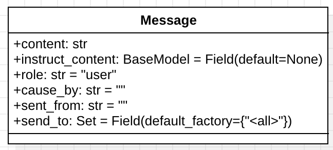
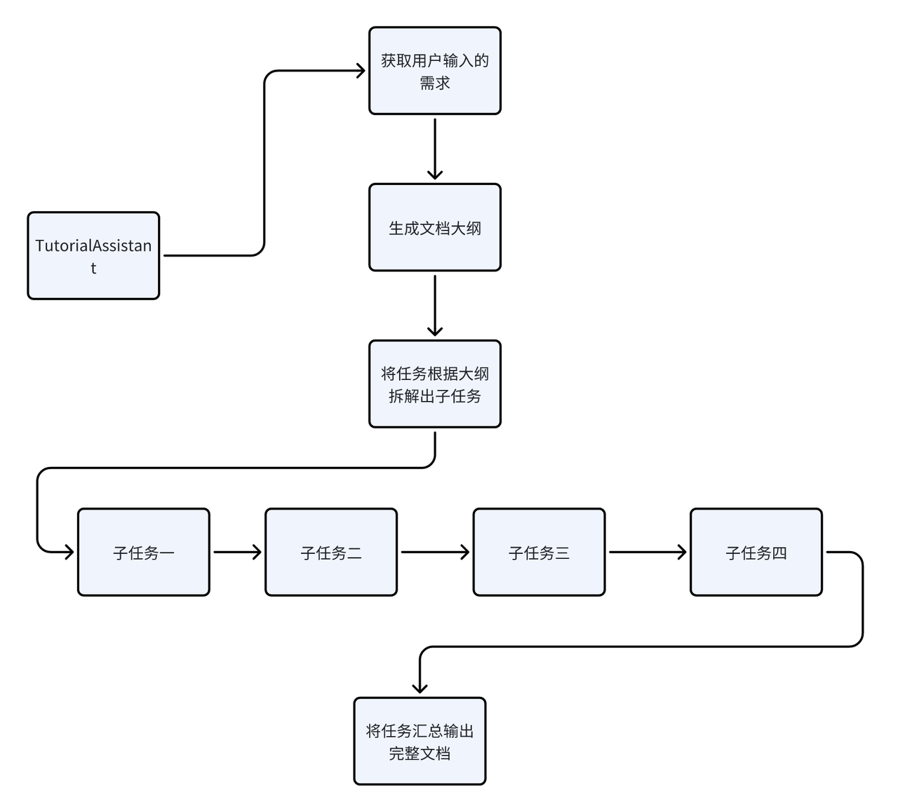
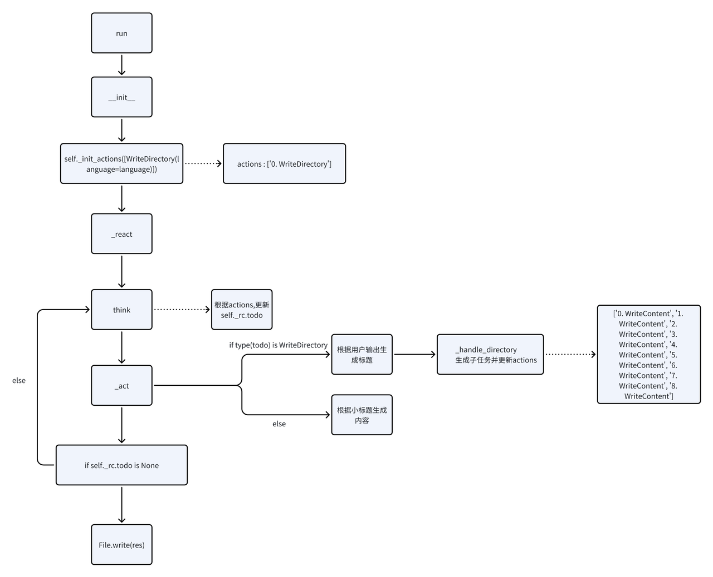
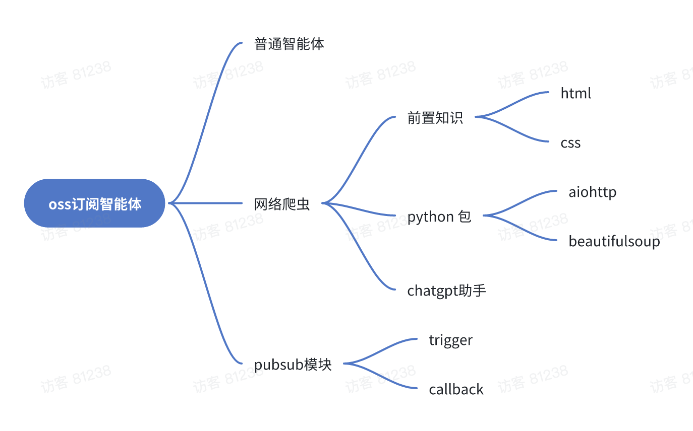
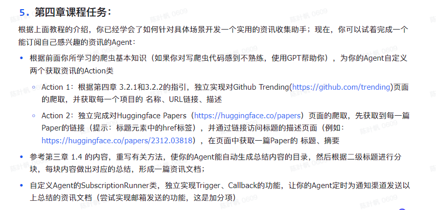

# MetaGPT 学习笔记

## Table of Contents
- [Chapter 1](# Chapter 1: Introduction)
- [Chapter 2](# Chapter 2: Agent)
- [Chapter 3](# Chapter 3: MetaGPT框架组件介绍)
- [Chapter 4](# Chapter 4: 订阅智能体)


# Chapter 1: Introduction 

<https://docs.deepwisdom.ai/main/zh/guide/get_started/introduction.html>

[《MetaGPT智能体开发入门》教程](https://deepwisdom.feishu.cn/docx/RJmTdvZuPozAxFxEpFxcbiPwnQf)

助教GPTs： <https://chat.openai.com/g/g-F4pnkAK5S-professional-tech-tutorial-assistant>


## 安装

**请确保你的系统已安装Python 3.9+**

```!shell
pip install metagpt
# pip install -i https://pypi.tuna.tsinghua.edu.cn/simple metagpt==0.5.2（推荐）
```


### 配置API：

> MetaGPT提供两种种配置OpenAI API key的方法，你可以将自己的OpenAI API key保存为环境变量，这样在你本地网络通畅的情况下（请确保你能够访问到openai）就可以直接使用OpenAI服务

```!shell
import os
os.environ["OPENAI_API_KEY"] = "sk-..."  # 填入你自己的OpenAI API key
os.environ["OPENAI_API_MODEL"] = "intended model" # 选择你要使用的模型，例如：gpt-4, gpt-3.5-turbo
os.environ["OPENAI_API_BASE"] = "https://api.openai-forward.com/v1"

```

同时MetaGPT还提供了利用`config.yaml`文件来配置OpenAI API服务的方法

1. 在当前项目的工作目录下，新建一个文件夹`config`并在该文件夹下添加一个`config.yaml`或`key.yaml`文件

2. 拷贝样例配置 [config.yaml](https://github.com/geekan/MetaGPT/blob/main/config/config.yaml) 中的内容到你的新文件中。

3. 在新文件内设置自己的OPENAI API KEY配置


**MetaGPT将会按照下述优先级来读取你的配置：`config/key.yaml > config/config.yaml > environment variable`**

### 尝试

```!shell
#  software startup example

import asyncio
from metagpt.roles import (
    Architect,
    Engineer,
    ProductManager,
    ProjectManager,
)
from metagpt.team import Team

async def startup(idea: str):
    company = Team()
    company.hire(
        [
            ProductManager(),
            Architect(),
            ProjectManager(),
            Engineer(),
        ]
    )
    company.invest(investment=3.0)
    company.start_project(idea=idea)

    await company.run(n_round=5)


asyncio.run(startup(idea="write a cli blackjack game")) # blackjack: 二十一点

```

在notebook中执行下面命令，运行并得到生成的游戏代码

```python
await startup(idea="write a cli blackjack game") # blackjack: 二十一点
```


## 补充
<details>
  <summary>协程与异步IO</summary>
  **[协程与异步IO](https://www.liujiangblog.com/course/python/83)**
  
   > **协程，又称微线程，英文名`Coroutine`**，是运行在单线程中的“并发”，协程相比多线程的一大优势就是省去了多线程之间的切换开销，获得了更高的运行效率。Python中的异步IO模块asyncio就是基本的协程模块。

   > **进程/线程：操作系统提供的一种并发处理任务的能力。**
   >
   > **协程：程序员通过高超的代码能力，在代码执行流程中人为的实现多任务并发，是单个线程内的任务调度技巧。**

   > **yield的语法规则是：在yield这里暂停函数的执行，并返回yield后面表达式的值（默认为None），直到被next()方法再次调用时，从上次暂停的yield代码处继续往下执行。**当没有可以继续next()的时候，抛出异常，该异常可被for循环处理。

   ```python
   def fib(n):
       a, b = 0, 1
       i = 0
       while i < n:
           yield b
           a, b = b, a+b
           i += 1
   
   f = fib(10)
   for item in f:
       print(item)
   ```

   > **每个生成器都可以执行send()方法，为生成器内部的yield语句发送数据**。此时yield语句不再只是`yield xxxx`的形式，还可以是`var = yield xxxx`的赋值形式。**它同时具备两个功能，一是暂停并返回函数，二是接收外部send()方法发送过来的值，重新激活函数，并将这个值赋值给var变量！**

   ```python
   def simple_coroutine():
       print('-> 启动协程')
       y = 10
       x = yield y
       print('-> 协程接收到了x的值:', x)
   
   my_coro = simple_coroutine()
   ret = next(my_coro)
   print(ret)
   my_coro.send(10)
   
   """
   1. `my_coro = simple_coroutine()` - 这行创建了协程的一个实例。
   
   2. `ret = next(my_coro)` - 使用 `next()` 函数开始协程的执行。协程会运行到第一个 `yield` 表达式，然后暂停，并返回 `y` 的值（10）。这个值被存储在变量 `ret` 中。
   
   3. `print(ret)` - 打印 `ret` 的值，结果应该是10。
   
   4. `my_coro.send(10)` - 这行将值10发送回协程。协程从 `yield` 语句处恢复执行，10被赋值给变量 `x`，然后协程继续执行直到完成。
   """
   ```

   > 因为send()方法的参数会成为暂停的yield表达式的值，所以，仅当协程处于暂停状态时才能调用 send()方法，例如`my_coro.send(10)`。不过，如果协程还没激活（状态是`'GEN_CREATED'`），就立即把None之外的值发给它，会出现TypeError。因此，始终要先调用`next(my_coro)`激活协程（也可以调用`my_coro.send(None)`），这一过程被称作预激活。

   > **@asyncio.coroutine：asyncio模块中的装饰器，用于将一个生成器声明为协程。**
   >
   > **yield from 其实就是等待另外一个协程的返回。**

   ```python
   def func():
       for i in range(10):
           yield i
   
   print(list(func()))
   
   ###########
   
   def func():
       yield from range(10)
   
   print(list(func()))
   ```

   ```python
   import asyncio
   import datetime
   
   @asyncio.coroutine  # 声明一个协程
   def display_date(num, loop):
       end_time = loop.time() + 10.0
       while True:
           print("Loop: {} Time: {}".format(num, datetime.datetime.now()))
           if (loop.time() + 1.0) >= end_time:
               break
           yield from asyncio.sleep(2)  # 阻塞直到协程sleep(2)返回结果
   loop = asyncio.get_event_loop()  # 获取一个event_loop
   tasks = [display_date(1, loop), display_date(2, loop)]
   loop.run_until_complete(asyncio.gather(*tasks))  # "阻塞"直到所有的tasks完成
   loop.close()
   ```

   > Python3.5中对协程提供了更直接的支持，引入了`async/await`关键字。上面的代码可以这样改写：使用`async`代替`@asyncio.coroutine`，使用`await`代替`yield from`，代码变得更加简洁可读。从Python设计的角度来说，`async/await`让协程独立于生成器而存在，不再使用yield语法。

   ```python
   import asyncio
   import datetime
   
   async def display_date(num, loop):      # 注意这一行的写法
       end_time = loop.time() + 10.0
       while True:
           print("Loop: {} Time: {}".format(num, datetime.datetime.now()))
           if (loop.time() + 1.0) >= end_time:
               break
           await asyncio.sleep(2)  # 阻塞直到协程sleep(2)返回结果
   
   loop = asyncio.get_event_loop()  # 获取一个event_loop
   tasks = [display_date(1, loop), display_date(2, loop)]
   loop.run_until_complete(asyncio.gather(*tasks))  # "阻塞"直到所有的tasks完成
   loop.close()
   ```

   > asyncio的使用可分三步走：
   >
   > 1. 创建事件循环
   >
   > 2. 指定循环模式并运行
   >
   > 3. 关闭循环
   >
   > 通常我们使用`asyncio.get_event_loop()`方法创建一个循环。

   > 运行循环有两种方法：一是调用`run_until_complete()`方法，二是调用`run_forever()`方法。`run_until_complete()`内置`add_done_callback`回调函数，`run_forever()`则可以自定义`add_done_callback()`

</details>

# Chapter 2: Agent

[【直播回放】MetaGPT作者深度解析直播回放\_哔哩哔哩\_bilibili](https://www.bilibili.com/video/BV1Ru411V7XL/?spm_id_from=333.337.search-card.all.click)

[基于大语言模型的AI Agents—Part 1 | ](https://www.breezedeus.com/article/ai-agent-part1)[Breezedeus.com](Breezedeus.com)

What is Agent: according to MG

> 智能体 = LLM+观察+思考+行动+记忆
>
> 多智能体 = 智能体+环境+SOP+评审+路由+订阅+经济


# Chapter 3: MetaGPT框架组件介绍

在MetaGPT看来，可以将智能体想象成环境中的数字人，其中

> 智能体 = 大语言模型（LLM） + 观察 + 思考 + 行动 + 记忆


> **在MetaGPT内 `Role` 类是智能体的逻辑抽象**

## Action
<details>
  <summary>源码</summary>


   <https://github.com/geekan/MetaGPT/blob/main/metagpt/actions/action.py>

   这段代码定义了一个Python类的继承体系，用于创建和注册不同种类的“行动”或任务，这些任务能够与LLM交互。代码中类和功能的作用如下：

   1. `action_subclass_registry`：这是一个字典，用于保存所有从`Action`基类继承的子类。

   2. `Action` 类：这是一个基础类，表示一个通用的行动。它们带有以下属性：

      - `name`: 行动的名称。

      - `llm`: 和LLM的接口。默认情况下，此处使用`LLM`类的实例，但通过设置为`exclude=True`来避免在`dict`输出中包括此字段。

      - `context`: 行动的上下文，可以是各种类型，用于行动的执行。

      - `prefix`: 系统消息的前缀。在函数`set_prefix`中被使用。

      - `desc`: 行动描述，用于技能管理。

      - `node`: `ActionNode` 类的实例，用于具体定义行动的结构和行为。

      - `builtin_class_name`: 类的名称，子类的名称会自动设置为此变量的值。

   3. `__init_with_instruction` 方法：初始化方法，用于根据指令创建`ActionNode`实例。

   4. `__init__` 方法：覆盖基类的初始化方法。除了父类的初始化外，还动态地反序列化子类，并注册其类名。如果提供了`instruction`参数，还会调用`__init_with_instruction`方法。

   5. `__init_subclass__` 方法：当创建`Action`的子类时自动调用，将子类注册到`action_subclass_registry`字典中。

   6. `dict` 方法：覆盖基类的`dict`方法，从返回的字典中移除`llm`属性。

   7. `set_prefix` 方法：用于设置消息前缀，并更新相关的`llm`系统提示和`node`的`llm`属性。

   8. `__str__` 和 `__repr__` 方法：定义类实例的字符串表示，方便打印和调试。

   9. `_aask` 方法：异步发送提示到`llm`，通常用于获取模型生成的文本。这个方法默认附加了`prefix`属性作为系统消息。

   10. `_run_action_node` 方法：异步运行与`ActionNode`相关的逻辑，这通常涉及使用上下文信息和`llm`与具体的节点交互。

   11. `run` 方法：是一个异步方法，通常由子类实现具体的行动。如果`node`被设置，则会使用`_run_action_node`处理相关逻辑，否则会提示未实现错误。

</details>   

   

简单例子：simpleCoder

````python
import re
import asyncio
from metagpt.actions import Action

class SimpleWriteCode(Action):

    PROMPT_TEMPLATE = """
    Write a python function that can {instruction} and provide two runnnable test cases.
    Return ```python your_code_here ``` with NO other texts,
    your code:
    """

    def __init__(self, name="SimpleWriteCode", context=None, llm=None):
        super().__init__(name, context, llm)

    async def run(self, instruction: str):

        prompt = self.PROMPT_TEMPLATE.format(instruction=instruction)

        rsp = await self._aask(prompt)

        code_text = SimpleWriteCode.parse_code(rsp)

        return code_text

    @staticmethod
    def parse_code(rsp):
        pattern = r'```python(.*)```'
        match = re.search(pattern, rsp, re.DOTALL)
        code_text = match.group(1) if match else rsp
        return code_text
````


## Message


<details>
  <summary>源码</summary>


   <https://github.com/geekan/MetaGPT/blob/main/metagpt/schema.py>

   `Message` 类用于表示消息数据，并提供了多种方法来处理消息内容和属性。
</details>  


## Role

<details>
  <summary>源码</summary>

   <https://github.com/geekan/MetaGPT/blob/main/metagpt/roles/role.py>

   run 方法： 

   > 如果有入参message就将message添加到role的记忆中如果没有入参就观察环境中的新消息

   ```python
   async def run(self, message=None):
       """Observe, and think and act based on the results of the observation
           观察，并根据观察结果进行思考和行动。"""
       if message:
           if isinstance(message, str):
               message = Message(message)
           if isinstance(message, Message):
               self.recv(message)
           if isinstance(message, list):
               self.recv(Message("\n".join(message)))
            '''如果message存在，它会检查message的类型，
               如果是字符串，则将其转换为Message对象；
               如果是Message对象，则直接调用recv方法；
               如果是列表，则将列表中的消息合并成一个新的消息，然后再调用recv方法。
               相当于预处理将入参转化为Message对象并添加到role的记忆中'''
       elif not await self._observe():
           # If there is no new information, suspend and wait
           logger.debug(f"{self._setting}: no news. waiting.")
           return
   
       rsp = await self.react()
       # Publish the reply to the environment, waiting for the next subscriber to process
       self._publish_message(rsp)
       return rsp
   
   ```

   本质：Observe, and think and act based on the results of the observation （即ReAct）

   ```python
   async def react(self) -> Message:
       """Entry to one of three strategies by which Role reacts to the observed Message
           通过观察到的消息，角色对其中一种策略进行反应。"""
       if self._rc.react_mode == RoleReactMoRoleReactMode.REACTde.REACT:
           rsp = await self._react()
       elif self._rc.react_mode == RoleReactMode.BY_ORDER:
           rsp = await self._act_by_order()
       elif self._rc.react_mode == RoleReactMode.PLAN_AND_ACT:
           rsp = await self._plan_and_act()
       self._set_state(state=-1) # current reaction is complete, reset state to -1 and todo back to None
       return rsp
   
   
   async def _react(self) -> Message:
           """Think first, then act, until the Role _think it is time to stop and requires no more todo.
           This is the standard think-act loop in the ReAct paper, which alternates thinking and acting in task solving, i.e. _think -> _act -> _think -> _act -> ... 
           Use llm to select actions in _think dynamically
           """
           actions_taken = 0
           rsp = Message("No actions taken yet") # will be overwritten after Role _act
           while actions_taken < self._rc.max_react_loop:
               # think
               await self._think()
               if self._rc.todo is None:
                   break
               # act
               logger.debug(f"{self._setting}: {self._rc.state=}, will do {self._rc.todo}")
               rsp = await self._act()
               actions_taken += 1
           return rsp # return output from the last action
   ```
</details> 
   

   

例子：  

```python
class SimpleCoder(Role):
    def __init__(
        self,
        name: str = "Alice",
        profile: str = "SimpleCoder",
        **kwargs,
    ):
        super().__init__(name, profile, **kwargs)
        self._init_actions([SimpleWriteCode])

    async def _act(self) -> Message:
        logger.info(f"{self._setting}: ready to {self._rc.todo}")
        todo = self._rc.todo  # todo will be SimpleWriteCode()

        msg = self.get_memories(k=1)[0]  # find the most recent messages

        code_text = await todo.run(msg.content)
        msg = Message(content=code_text, role=self.profile,
                      cause_by=type(todo))

        return msg
```


## 实现：技术文档助手

> 因为token限制的原因，我们先通过 `LLM` 大模型生成教程的目录，再对目录按照二级标题进行分块，对于每块目录按照标题生成详细内容，最后再将标题和内容进行拼接，解决 `LLM` 大模型长文本的限制问题。




1. Action: `WriteDirectory`

   根据用户需求生成文章大纲

   prompt 参考：

   ```python
   COMMON_PROMPT = """
           You are now a seasoned technical professional in the field of the internet. 
           We need you to write a technical tutorial with the topic "{topic}".
           您现在是互联网领域的经验丰富的技术专业人员。
           我们需要您撰写一个关于"{topic}"的技术教程。
           """
   
   DIRECTORY_PROMPT = COMMON_PROMPT + """
           Please provide the specific table of contents for this tutorial, strictly following the following requirements:
           1. The output must be strictly in the specified language, {language}.
           2. Answer strictly in the dictionary format like {{"title": "xxx", "directory": [{{"dir 1": ["sub dir 1", "sub dir 2"]}}, {{"dir 2": ["sub dir 3", "sub dir 4"]}}]}}.
           3. The directory should be as specific and sufficient as possible, with a primary and secondary directory.The secondary directory is in the array.
           4. Do not have extra spaces or line breaks.
           5. Each directory title has practical significance.
           请按照以下要求提供本教程的具体目录：
           1. 输出必须严格符合指定语言，{language}。
           2. 回答必须严格按照字典格式，如{{"title": "xxx", "directory": [{{"dir 1": ["sub dir 1", "sub dir 2"]}}, {{"dir 2": ["sub dir 3", "sub dir 4"]}}]}}。
           3. 目录应尽可能具体和充分，包括一级和二级目录。二级目录在数组中。
           4. 不要有额外的空格或换行符。
           5. 每个目录标题都具有实际意义。
           """
   ```

   而后，根据LLM的rsp: str, 通过`extract_struct` function extract 相应的数据结构，如：

   ```python
   
   >>> text = 'xxx {"x": 1, "y": {"a": 2, "b": {"c": 3}}} xxx'
   >>> result_dict = OutputParser.extract_struct(text, "dict")
   >>> print(result_dict)
   >>> # Output: {"x": 1, "y": {"a": 2, "b": {"c": 3}}}
   ```

2. Action: `WriteContent`

   根据传入的子标题来生成内容

   参考prompt：

   ```python
   COMMON_PROMPT = """
           You are now a seasoned technical professional in the field of the internet. 
           We need you to write a technical tutorial with the topic "{topic}".
           """
           CONTENT_PROMPT = COMMON_PROMPT + """
           Now I will give you the module directory titles for the topic. 
           Please output the detailed principle content of this title in detail. 
           If there are code examples, please provide them according to standard code specifications. 
           Without a code example, it is not necessary.
   
           The module directory titles for the topic is as follows:
           {directory}
   
           Strictly limit output according to the following requirements:
           1. Follow the Markdown syntax format for layout.
           2. If there are code examples, they must follow standard syntax specifications, have document annotations, and be displayed in code blocks.
           3. The output must be strictly in the specified language, {language}.
           4. Do not have redundant output, including concluding remarks.
           5. Strict requirement not to output the topic "{topic}".
           现在我将为您提供该主题的模块目录标题。
           请详细输出此标题的详细原理内容。
           如果有代码示例，请按照标准代码规范提供。
           没有代码示例则不需要提供。
           
           该主题的模块目录标题如下：
           {directory}
           
           严格按照以下要求限制输出：
           1. 遵循Markdown语法格式进行布局。
           2. 如果有代码示例，必须遵循标准语法规范，具备文档注释，并以代码块形式显示。
           3. 输出必须严格使用指定语言{language}。
           4. 不得有冗余输出，包括总结性陈述。
           5. 严禁输出主题"{topic}"。
           """
   ```

3. Role: `TutorialAssistant`

   ReAct

   流程：

   

Before running the code, create a config folder in the path where the code will be executed, and place the config.yaml file containing information such as the OpenAI API key into it.

code: [simple coder](./code/agent101_simple_coder.ipynb)

code: [tutorial Assistant & homework](./code/agent101_TutorialAssistant.ipynb)


# Chapter 4: 订阅智能体

## Introduction

定义：

> 让Agent为我们关注某些想关注的信息，当有我们关注的事件发生时，Agent获取信息并进行处理，然后通过一些如邮件、微信、discord等通知渠道将处理后的信息发送给我们，我们将这类Agent称为订阅智能体

action： **从外界信息源中搜集信息**和**对搜集得到的信息进行总结**

额外功能： **定时运行**的功能和发送到**通知渠道**的功能




`metagpt.subscription`模块提供了`SubscriptionRunner`类

```python
>>> import asyncio
>>> from metagpt.subscription import SubscriptionRunner
>>> from metagpt.roles import Searcher
>>> from metagpt.schema import Message

>>> async def trigger():
...     while True:
...         yield Message("the latest news about OpenAI")
...         await asyncio.sleep(3600 * 24)

>>> async def callback(msg: Message):
...     print(msg.content)

>>> async def main():
...     pb = SubscriptionRunner()
...     await pb.subscribe(Searcher(), trigger(), callback)
...     await pb.run()

>>> asyncio.run(main())
```

> 订阅智能体的实现主要有3个要素，分别是Role、Trigger、Callback，即智能体本身、触发器、数据回调


## 实现OOS 订阅智能体

OSS(Open Source Software)
基本概念补充
<details>
  <summary>HTML</summary>
  HTML（超文本标记语言）是用于创建网页的标准标记语言。它的基本结构包括以下几个部分：

  1. **文档类型声明（Doctype）**：它声明了文档的类型和 HTML 的版本，例如 `<!DOCTYPE html>` 表明该文档是 HTML5。

  2. **HTML 标签**：文档开始和结束的地方，分别用 `<html>` 和 `</html>` 表示。

  3. **头部（Head）区域**：

     - `<head>` 标签包含了文档的元数据，如字符集定义 `<meta charset="UTF-8">`。

     - `<title>` 标签定义了文档的标题，显示在浏览器的标题栏或页面的标签页上。

     - 链接外部资源，如样式表 `<link rel="stylesheet" href="styles.css">`。

  4. **主体（Body）区域**：这是文档的主要内容部分，使用 `<body>` 和 `</body>` 标签包裹。

     - **文本内容**：如 `<h1>` 到 `<h6>` 用于标题，`<p>` 用于段落。

     - **链接**：`<a href="url">` 用来创建超链接。

     - **图像**：`` 用于嵌入图像。

     - **列表**：有序列表 `<ol>` 和无序列表 `<ul>`，列表项用 `<li>` 表示。

     - **表格**：由 `<table>` 创建，内部包含 `<tr>`（行）、`<td>`（单元格）等元素。

     - **表单**：`<form>` 用于收集用户输入，内部包含输入字段 `<input>`、按钮 `<button>` 等。

  5. **注释**：使用 `<!-- 注释内容 -->` 来添加注释，注释不会显示在浏览器中。

  HTML 包含更多的标签和属性，可以用来创建丰富和动态的网页内容。
</details> 
<details>
    <summary>CSS</summary>

  CSS（层叠样式表）在 HTML 中的作用主要是用来定义网页的样式。它提供了一种强大的方式来控制网页的布局和外观。以下是 CSS 在 HTML 中的几个关键作用：

  1. **格式化文本**：CSS 可以改变文本的大小、颜色、字体、行间距等。例如，可以指定段落文字的字体大小和颜色。

  2. **布局控制**：CSS 使得创建复杂的页面布局成为可能。它可以控制元素的位置、大小、外边距（margin）、内边距（padding）等。例如，可以用 CSS 设定两列或三列布局。

  3. **页面响应式设计**：通过媒体查询（Media Queries），CSS 可以根据不同的屏幕大小和设备特性应用不同的样式规则。这对于制作在手机、平板电脑和桌面电脑上都能良好显示的网页非常重要。

  4. **网页美化**：CSS 提供了丰富的视觉效果，如背景颜色和图像、边框样式、阴影效果、动画等。这些都可以用来增强网页的视觉吸引力和用户体验。

  5. **页面一致性**：通过使用外部样式表，可以确保整个网站的一致性。对外部样式表的任何修改都会在所有连接到该样式表的 HTML 页面上反映出来，使得维护和更新网站样式更加高效。

  6. **与 HTML 的分离**：将样式信息与 HTML 结构分离，使得 HTML 代码更加清晰，也更容易维护和管理。

  在 HTML 中，可以通过以下三种方式来应用 CSS：

  - **内联样式**：直接在 HTML 元素上使用 `style` 属性。

  - **内部样式表**：在 HTML 文档的 `<head>` 部分使用 `<style>` 标签。

  - **外部样式表**：使用 `<link>` 标签链接到一个外部的 CSS 文件。

  CSS 的强大和灵活性使其成为网页设计和前端开发中不可或缺的工具。
</details>

<details>
  <summary>aiohttp</summary>

  `aiohttp` 是一个基于异步 I/O（输入/输出）的 Python 库，用于客户端和服务器端的 HTTP 网络通信。使用 `aiohttp` 可以高效地处理大量并发的 HTTP 请求。下面是使用 `aiohttp` 发起网络请求的基本步骤：

  ### 安装 aiohttp

  首先，确保安装了 `aiohttp` 库。如果还没有安装，可以通过 pip 进行安装：

  ```bash
  pip install aiohttp
  ```

  ### 异步 HTTP 客户端的基本用法

  #### 导入库

  ```python
  import aiohttp
  import asyncio
  ```

  #### 发起 GET 请求

  使用 `aiohttp.ClientSession()` 创建一个会话，然后使用 `session.get(url)` 发起 GET 请求。

  ```python
  async def fetch(session, url):
      async with session.get(url) as response:
          return await response.text()
  
  async def main():
      async with aiohttp.ClientSession() as session:
          html = await fetch(session, 'http://python.org')
          print(html)
  
  asyncio.run(main())
  ```

  #### 发起 POST 请求

  类似于 GET 请求，使用 `session.post(url, data=...)` 发起 POST 请求。

  ```python
  async def post_data(session, url, data):
      async with session.post(url, data=data) as response:
          return await response.text()
  
  async def main():
      async with aiohttp.ClientSession() as session:
          data = {'key': 'value'}
          response = await post_data(session, 'http://httpbin.org/post', data)
          print(response)
  
  asyncio.run(main())
  ```

  #### 处理异常

  在网络请求过程中，处理可能出现的异常是一个好习惯。

  ```python
  async def fetch_with_error_handling(session, url):
      try:
          async with session.get(url) as response:
              return await response.text()
      except aiohttp.ClientError as e:
          print(f"A network-related error occurred: {e}")
      except Exception as e:
          print(f"An unexpected error occurred: {e}")
  
  # 使用此函数与上述示例中的 main 函数一起
  ```

  ### 注意事项

  - 使用异步代码时，所有与网络请求相关的操作都应该在 `async` 函数内执行。

  - `asyncio.run(main())` 是启动异步程序的标准方式。

  - 确保在异步函数中处理异常，以避免程序意外崩溃。

  这些是 `aiohttp` 的基本用法。通过它，你可以高效地在 Python 中处理 HTTP 请求。由于其异步特性，`aiohttp` 特别适用于需要高并发的应用场景。
</details>


### Role: OSSWatcher 实现

定位：**帮我们关注并分析热门的开源项目，当有相关信息时将信息推送给我们，这里需要确定让 OSS 从哪个网页获取信息**

两个action：**爬取热门开源项目**和**分析热门开源项目**。

#### GitHub Trending爬取

参考：<https://chat.openai.com/share/6c8046d3-e363-40bd-9412-8d859e7b3854>

#### GitHub Trending总结

````python
TRENDING_ANALYSIS_PROMPT = """# Requirements
You are a GitHub Trending Analyst, aiming to provide users with insightful and personalized recommendations based on the latest
GitHub Trends. Based on the context, fill in the following missing information, generate engaging and informative titles, 
ensuring users discover repositories aligned with their interests.

# The title about Today's GitHub Trending
## Today's Trends: Uncover the Hottest GitHub Projects Today! Explore the trending programming languages and discover key domains capturing developers' attention. From ** to **, witness the top projects like never before.
## The Trends Categories: Dive into Today's GitHub Trending Domains! Explore featured projects in domains such as ** and **. Get a quick overview of each project, including programming languages, stars, and more.
## Highlights of the List: Spotlight noteworthy projects on GitHub Trending, including new tools, innovative projects, and rapidly gaining popularity, focusing on delivering distinctive and attention-grabbing content for users.
---
# Format Example

```
# [Title]

## Today's Trends
Today, ** and ** continue to dominate as the most popular programming languages. Key areas of interest include **, ** and **.
The top popular projects are Project1 and Project2.

## The Trends Categories
1. Generative AI
    - [Project1](https://github/xx/project1): [detail of the project, such as star total and today, language, ...]
    - [Project2](https://github/xx/project2): ...
...

## Highlights of the List
1. [Project1](https://github/xx/project1): [provide specific reasons why this project is recommended].
...
```

---
# Github Trending
{trending}
"""
````


#### OSSWatcher Role

加入`CrawlOSSTrending` 和 `AnalysisOSSTrending` 两个action

```python
from metagpt.roles import Role

class OssWatcher(Role):
    def __init__(
        self,
        name="Codey",
        profile="OssWatcher",
        goal="Generate an insightful GitHub Trending analysis report.",
        constraints="Only analyze based on the provided GitHub Trending data.",
    ):
        super().__init__(name, profile, goal, constraints)
        self._init_actions([CrawlOSSTrending, AnalysisOSSTrending])
        self._set_react_mode(react_mode="by_order")

    async def _act(self) -> Message:
        logger.info(f"{self._setting}: ready to {self._rc.todo}")
        # By choosing the Action by order under the hood
        # todo will be first SimpleWriteCode() then SimpleRunCode()
        todo = self._rc.todo

        msg = self.get_memories(k=1)[0] # find the most k recent messages
        result = await todo.run(msg.content)

        msg = Message(content=str(result), role=self.profile, cause_by=type(todo))
        self._rc.memory.add(msg)
        return msg
```


### Trigger

使用crontab 实现定时触发

使用`aiocron`我们可以直接使用cron的语法制定定时任务

```python
# 结合aiocron使用类的方式，来实现定时Trigger

import time
from aiocron import crontab
from typing import Optional
from pytz import BaseTzInfo
from pydantic import BaseModel, Field
from metagpt.schema import Message


class OssInfo(BaseModel):
    url: str
    timestamp: float = Field(default_factory=time.time)


class GithubTrendingCronTrigger():

    def __init__(self, spec: str, tz: Optional[BaseTzInfo] = None, url: str = "https://github.com/trending") -> None:
        self.crontab = crontab(spec, tz=tz)
        self.url = url

    def __aiter__(self):
        return self

    async def __anext__(self):
        await self.crontab.next()
        return Message(self.url, OssInfo(url=self.url))
```

```python
# 创建 GithubTrendingCronTrigger 实例，指定每天 UTC 时间 10:00 AM 触发
cron_trigger = GithubTrendingCronTrigger("0 10 * * *")
```

**思考题**
<details>
  <summary>思考1</summary>
  如果需要榜单更新再推送，可以如何实现？

   对之前的榜单数据用hash 函数计算hash值， 并保存在本地；

   每一次`CrawlOSSTrending`计算一次hash值，比对前后hash值是否相等

   即：

   ```python
   # 初始化变量
   prev_hash = None
   
   # 无限循环，定时执行CrawlOSSTrending
   while True:
     # 调用函数CrawlOSSTrending以获取最新的榜单数据
     msg_now = CrawlOSSTrending()
   
     # 计算当前数据的hash值
     now_hash = hash(msg_now)
   
     # 比对前后hash值是否相等
     if prev_hash is not None and prev_hash != now_hash:
       # 如果hash不相同，则执行analysis
       AnalysisOSSTrending(msg_now)
   
     # 将当前hash值存为“前一次的hash值”，以便下次循环时使用
     prev_hash = now_hash
   
     # 等待一定时间后再次执行循环（时间根据实际情况设定）
     Sleep(some_time_period)
     
   ```
</details>
<details>
  <summary>思考2</summary>
  Crontab的定时方式可能不是很方便进行调试，有什么方便调试的方法吗？

   ```python
   from pytz import timezone
   ## test
   
   async def test_cron_trigger(cron_trigger):
       async for message in cron_trigger:
           print(message)
           break  # 为了测试，我们在接收到第一个消息后就退出循环
   
   
   
   current_time = datetime.now()
   target_time = current_time + timedelta(minutes=1)
   cron_expression = target_time.strftime('%M %H %d %m %w')
   print(cron_expression)
   
   # trigger_after 1 min
   beijing_tz = timezone('Asia/Shanghai')  #获取北京时间的时区
   cron_trigger = GithubTrendingCronTrigger(cron_expression, tz=beijing_tz)
   
   # 启动异步测试
   await test_cron_trigger(cron_trigger)
   ```
</details>


### Callback

实现agent将数据发送至Discord

注册账号

在[discord的开发者面板](https://discord.com/developers/applications)添加BOT

将BOT添加到某个服务器中

参考：

<https://discordpy.readthedocs.io/en/stable/discord.html>

<https://realpython.com/how-to-make-a-discord-bot-python/>

token获取[discord readthedocs](https://discordpy.readthedocs.io/en/stable/discord.html)

DISCORD_CHANNEL_ID： 注意**是频道ID不是服务器ID！**


```python
import os
from environs import load_dotenv

load_dotenv('.env')

TOKEN = os.getenv('DISCORD_TOKEN')
CHANNEL_ID = os.getenv('DISCORD_CHANNEL_ID')
proxy = os.getenv('global_proxy')

# callback
import os
import discord
async def discord_callback(msg: Message):
    intents = discord.Intents.default()
    intents.message_content = True
    intents.members = True

    client = discord.Client(intents=intents, proxy=proxy)
    token = os.environ["DISCORD_TOKEN"]
    channel_id = int(os.environ["DISCORD_CHANNEL_ID"])

    async with client:
        await client.login(token)
        channel = await client.fetch_channel(channel_id)
        lines = []
        for i in msg.content.splitlines():
            if i.startswith(("# ", "## ", "### ")):
                if lines:
                    await channel.send("\n".join(lines))
                    lines = []
            lines.append(i)

        if lines:
            await channel.send("\n".join(lines))
```

效果：


## Code 实现

完整OSS watcher代码实现: [ossWatcher](./code/agent101_ossWatcher.ipynb)


### Homework



huggingface daily paper watcher: [HFDailyPaperWatcher](./code/agent101_chapter4_homework_HFDailyPaperWatcher.ipynb)


效果：


#### 1\. Fetch Daily paper 

1. 首先爬取主页面获得每个paper的title和对应href

   ```python
   async def parse_main_page(html):
       title_list = []
       href_list = []
       soup = BeautifulSoup(html, 'html.parser')
       # 更新查找标签的逻辑以匹配当前网页结构
       title_tags = soup.find_all('h3', class_='mb-1 text-lg font-semibold leading-[1.2] hover:underline peer-hover:underline md:text-2xl')
       for title_tag in title_tags:
           a_tag = title_tag.find('a')  # 标题内的<a>标签
           if a_tag:
               title = a_tag.text.strip()  # 清除空白字符得到标题文本
               href = a_tag['href']  # 提取href属性
               title_list.append(title)  # 添加标题到列表
               href_list.append(href)  # 添加链接到列表
       return title_list, href_list
   ```

2. 根据上一部获得的title和对应href， 遍历获取子页面的paper abstract 信息， 其中子页面url为 base_url+href

   ```python
   async def parse_sub_page(html):
       soup = BeautifulSoup(html, 'html.parser')
       abstract = soup.find('div', class_="pb-8 pr-4 md:pr-16").p.text
       arxiv_url = soup.find('a', class_="btn inline-flex h-9 items-center", href=True)['href']
       return abstract, arxiv_url
   
   async def main():
       url = 'https://huggingface.co/papers'
       base_url = 'https://huggingface.co'
       repositories = []
       try:
           html = await fetch_html(url)
           title_list, href_list = await parse_main_page(html)
   
           for title, href in zip(title_list, href_list):
               repo_info = {}
               repo_info['title'] = title
               # repo_info['href'] = href
               repositories.append(repo_info)
               # print(title, href)
               sub_html = await fetch_html(base_url + href)
               abstract, arxiv_url = await parse_sub_page(sub_html)
               # print(abstract, arxiv_url)
               repo_info['abstract'] = abstract
               repo_info['arxiv_url'] = arxiv_url
               repositories.append(repo_info)
           return repositories
       except Exception as e:
           print(f"An error occurred: {e}")
   ```

   这一步将获取当天所有paper信息， 并返回一个dict， 包含paper 的title， abstract， 和 Arxiv url

   如下：

   ```shell
   [{'title': 'InstantID: Zero-shot Identity-Preserving Generation in Seconds',
     'abstract': 'There has been significant progress in personalized image synthesis with\nmethods such as Textual Inversion, DreamBooth, and LoRA. Yet, their real-world\napplicability is hindered by high storage demands, lengthy fine-tuning\nprocesses, and the need for multiple reference images. Conversely, existing ID\nembedding-based methods, while requiring only a single forward inference, face\nchallenges: they either necessitate extensive fine-tuning across numerous model\nparameters, lack compatibility with community pre-trained models, or fail to\nmaintain high face fidelity. Addressing these limitations, we introduce\nInstantID, a powerful diffusion model-based solution. Our plug-and-play module\nadeptly handles image personalization in various styles using just a single\nfacial image, while ensuring high fidelity. To achieve this, we design a novel\nIdentityNet by imposing strong semantic and weak spatial conditions,\nintegrating facial and landmark images with textual prompts to steer the image\ngeneration. InstantID demonstrates exceptional performance and efficiency,\nproving highly beneficial in real-world applications where identity\npreservation is paramount. Moreover, our work seamlessly integrates with\npopular pre-trained text-to-image diffusion models like SD1.5 and SDXL, serving\nas an adaptable plugin. Our codes and pre-trained checkpoints will be available\nat https://github.com/InstantID/InstantID.',
     'arxiv_url': 'https://arxiv.org/abs/2401.07519'},
   ...
   ]
   ```

#### 2\. Action

将以上动作修改成`Action`：  `CrawlHuggingfaceDailyPaper`

将当天paper整理成dict，用于下一步动作

```python
from metagpt.actions.action import Action
from metagpt.config import CONFIG

class CrawlHuggingfaceDailyPaper(Action):
    """
    This class specifically targets the daily papers section of the Huggingface website.
    Its main functionality includes asynchronously fetching and parsing the latest research papers
    published on Huggingface, extracting relevant details such as titles, abstracts, and arXiv URLs.
    It can be utilized in applications where up-to-date research information from Huggingface
    is required, making it a valuable tool for researchers and developers in AI and machine learning.
    """

    async def run(self, url: str = "https://huggingface.co/papers"):
        async with aiohttp.ClientSession() as client:
            async with client.get(url, proxy=CONFIG.global_proxy) as response:
                response.raise_for_status()
                html = await response.text()

        title_list, href_list = await parse_main_page(html)

        repositories = []
        base_url = 'https://huggingface.co'

        for title, href in zip(title_list, href_list):
            repo_info = {'title': title}
            sub_html = await fetch_html(base_url + href)
            abstract, arxiv_url = await parse_sub_page(sub_html)
            repo_info['abstract'] = abstract
            repo_info['arxiv_url'] = arxiv_url

            repositories.append(repo_info)

        return repositories

```

接下来定义另一个action： SummaryDailyPaper， 将每一篇paper信息使用LLM进行改写： 

- 修改成markdown 格式

- 增加论文关键词提取

````python
from typing import Any
PAPER_SUMMARY_PROMPT = """
    Transform the given data about a research paper into a neat Markdown format. Also, identify and include five relevant keywords that best represent the core themes of the paper.
    The provided data is:
    ```
    {data}
    ```
    Please create a markdown summary and suggest five keywords related to this paper.
    """
class SummaryDailyPaper(Action):

    async def run(
        self,
        data: Any
    ):
        return await self._aask(PAPER_SUMMARY_PROMPT.format(data=data))
````


为什么不直接总结所有paper： **LLM上下文长度限制**


#### 3\. Role

接下来，定义一个角色`Role`: `DailyPaperWatcher`, 具备以上两个`Action`： `SummaryDailyPaper`,`CrawlHuggingfaceDailyPaper`

最简单版本

```python
from typing import Dict, List
from metagpt.utils.common import OutputParser
from metagpt.roles import Role
from metagpt.schema import Message
from metagpt.logs import logger

class DailyPaperWatcher(Role):
    def __init__(
        self,
        name="Huggy",
        profile="DailyPaperWatcher",
        goal="Generate a summary of Huggingface daily papers.",
        constraints="Only analyze based on the provided Huggingface daily papers.",
    ):
        super().__init__(name, profile, goal, constraints)
        self._init_actions([CrawlHuggingfaceDailyPaper])
        self._set_react_mode(react_mode="by_order")

    
    async def _act(self) -> Message:
        logger.info(f"{self._setting}: ready to {self._rc.todo}")

        todo = self._rc.todo

        try:
            msg = self.get_memories(k=1)[0]
        except IndexError:
            logger.error("No messages in memory")
            return Message(content="Error: No messages in memory", role=self.profile)

        try:
            result = await todo.run(msg.content)
            if isinstance(todo, CrawlHuggingfaceDailyPaper):
                # 针对每篇论文创建并执行 SummaryDailyPaper 动作
                logger.info(f"Preparing to summarize {len(result)} papers")
                msg_content = ''
                for paper in result:
                    summary_action = SummaryDailyPaper(paper)
                    summary_result = await summary_action.run(paper)
                    summary_msg = Message(content=str(summary_result), role=self.profile, cause_by=type(summary_action))
                    self._rc.memory.add(summary_msg)
                    msg_content += str(summary_result)
                    msg_content += '\n'

            else:
                msg = Message(content=str(result), role=self.profile, cause_by=type(todo))
                self._rc.memory.add(msg)

        except Exception as e:
            logger.error(f"Error during action execution: {e}")
            return Message(content=f"Error: {e}", role=self.profile)

        return Message(content=str(msg_content), role=self.profile, cause_by=type(todo))

```


几个小问题SummaryDailyPaper 总结时随机性丢失link（大概是prompt的问题）

使用一个for循环调用了SummaryDailyPaper， 应该有更优雅的方法


#### 4\. Trigger

基本没有太大变化

```python
import time
from aiocron import crontab
from typing import Optional
from pytz import BaseTzInfo
from pydantic import BaseModel, Field
from metagpt.schema import Message

class DailyPaperInfo(BaseModel):
    url: str
    timestamp: float = Field(default_factory=time.time)


class HuggingfaceDailyPaperCronTrigger():

    def __init__(self, spec: str, tz: Optional[BaseTzInfo] = None, url: str = "https://huggingface.co/papers") -> None:
        self.crontab = crontab(spec, tz=tz)
        self.url = url

    def __aiter__(self):
        return self

    async def __anext__(self):
        await self.crontab.next()
        return Message(self.url, DailyPaperInfo(url=self.url))

```

#### 5\. Callback

```python
# callback
import os
import discord
async def discord_callback(msg: Message):
    intents = discord.Intents.default()
    intents.message_content = True
    intents.members = True

    client = discord.Client(intents=intents)
    token = TOKEN
    channel_id = int(CHANNEL_ID)

    async with client:
        await client.login(token)
        channel = await client.fetch_channel(channel_id)
        lines = []
        for i in msg.content.splitlines():
            if i.startswith(("# ", "## ", "### ")):
                if lines:
                    await channel.send("\n".join(lines))
                    lines = []
            lines.append(i)

        if lines:
            await channel.send("\n".join(lines))
```


#### 6\. main

```python
from metagpt.subscription import SubscriptionRunner
# 运行入口，
async def main(spec: str = "54 16 * * *", discord: bool = True, wxpusher: bool = False):
    callbacks = []
    if discord:
        callbacks.append(discord_callback)

    if wxpusher:
        callbacks.append(wxpusher_callback)

    if not callbacks:
        async def _print(msg: Message):
            print(msg.content)
        callbacks.append(_print)

    async def callback(msg):
        await asyncio.gather(*(call(msg) for call in callbacks))

    runner = SubscriptionRunner()
    await runner.subscribe(DailyPaperWatcher(), HuggingfaceDailyPaperCronTrigger(spec), callback)
    await runner.run()

## test
from pytz import timezone
from datetime import datetime, timedelta

current_time = datetime.now()
target_time = current_time + timedelta(minutes=1)
cron_expression = target_time.strftime('%M %H %d %m %w')
print(cron_expression)

await main(cron_expression)
```


### 修改

改写SummaryDailyPaper

````python
from typing import Any
PAPER_SUMMARY_PROMPT = """
    Transform the given data about a research paper into a neat Markdown format. Also, identify and include five relevant keywords that best represent the core themes of the paper.
    Don't forget to include the title, abstract, and arXiv URL.
    The provided data is:
    ```
    {data}
    ```
    Please create a markdown summary and suggest five keywords related to this paper, as well as the title, abstract, and arXiv URL.
    """
class SummaryDailyPaper(Action):
    def __init__(self, data: Any):
        super().__init__(data)
        self.data = data

    async def run(
        self
    ):
        return await self._aask(PAPER_SUMMARY_PROMPT.format(data=self.data))
````

改写role

```python
class DailyPaperWatcher(Role):
    def __init__(
        self,
        name="Huggy",
        profile="DailyPaperWatcher",
        goal="Generate a summary of Huggingface daily papers.",
        constraints="Only analyze based on the provided Huggingface daily papers.",
    ):
        super().__init__(name, profile, goal, constraints)
        self._init_actions([CrawlHuggingfaceDailyPaper])
        self.tot_content = ""

    async def _act(self) -> Message:
        logger.info(f"{self._setting}: ready to {self._rc.todo}")

        todo = self._rc.todo
        if type(todo) is CrawlHuggingfaceDailyPaper:
            msg = self._rc.memory.get(k=1)[0]

            resp = await todo.run()
            logger.info(resp)
            return await self._handle_paper(resp)
        
        resp = await todo.run()
        logger.info(resp)
        
        if self.tot_content != "":
            self.tot_content += "\n\n\n"
        self.tot_content += resp
        return Message(content=resp, role=self.profile)
    

    async def _think(self) -> None:
        """Determine the next action to be taken by the role."""
        if self._rc.todo is None:
            self._set_state(0)
            return

        if self._rc.state + 1 < len(self._states):
            self._set_state(self._rc.state + 1)
        else:
            self._rc.todo = None

    async def _react(self) -> Message:
        """Execute the assistant's think and actions."""
        while True:
            await self._think()
            if self._rc.todo is None:
                break
            msg = await self._act()

        # return msg
        return Message(content=self.tot_content, role=self.profile)

    async def _handle_paper(self, paper_info) -> None:
        actions = []
        # Enhanced logging for debuggingself
        logger.debug(f"Handling paper with info: {paper_info}")
        self.tot_content += f"# Huggingface Daily Paper: {datetime.now().strftime('%Y-%m-%d')}"

        for paper in paper_info:
            # print(paper)
            actions.append(SummaryDailyPaper(paper))
            # logger.info(f"Preparing to summarize paper: {paper['title']}")

        self._init_actions(actions)
        self._rc.todo = None
        return Message(content="init", role=self.profile)

```

似乎更合理一些

<details>
    <summary>一些想法</summary>
    - 在这个场景下， 其实可以将callback也作为一种action，比如在summary一篇文章后就send discord message，而不是汇总后再发送；这样当每天paper数量非常多的时候能够减少等待时间；

   - 对于一个个体而言， 并没有精力关注所有的，不同领域的paper， 可以在SummaryDailyPaper的同时， 增加对感兴趣内容的排序和筛选；这部分内容可以用prompt实现, 或者训练一个排序模型。

      + prompt

         ````python
         """
         ## Optimized Prompt
         
         ### Instructions:
         1. You will receive a list of topics I am interested in, which is in priority order.
         2. Your task is to sort a given list of daily paper titles based on the relevance to my interests.
         3. Use the separators "Interest list:" and "Paper titles:" to clearly distinguish between the two lists.
         4. Provide the sorted output in a structured format, starting with the title most relevant to my top interest.
         5. Before delivering the output, confirm if all conditions are met. If there is a mismatch or ambiguity in interpreting the relevance, ask for clarification.
         6. Include at least two examples of how a sorted output should look based on a hypothetical interest list and paper titles.
         
         
         ---
         
         ### Example Interest List and Corresponding Sorted Titles:
         
         #### Example 1:
         - Interest List: Quantum Computing, Artificial Intelligence, Space Exploration
         - Paper Titles: A) The Next Frontier in AI, B) Quantum Breakthroughs of the Year, C) Mars: Our Future Home?
         - Expected Sorted Output:
           1. Quantum Breakthroughs of the Year
           2. The Next Frontier in AI
           3. Mars: Our Future Home?
         
         #### Example 2:
         - Interest List: Environmental Policy, Renewable Energy, Urban Development
         - Paper Titles: X) Solar Power in Modern Cities, Y) Legislating Climate Change, Z) Smart Cities: The Future of Urban Living
         - Expected Sorted Output:
           1. Legislating Climate Change
           2. Solar Power in Modern Cities
           3. Smart Cities: The Future of Urban Living
         
         ---
         ```
         ## Interest List:
         {Your prioritized topics should be listed here, clearly separated by commas.}
         
         ## Paper Titles:
         {The daily paper titles to be sorted should be listed here, clearly separated by commas or newlines.}
         ```
         ---
         Here is the re-ordered paper titles:
         
         """
         ````

   - 其实HF的daily paper有邮件订阅功能， trigger也可以是收到AK所发送的email。
</details>

